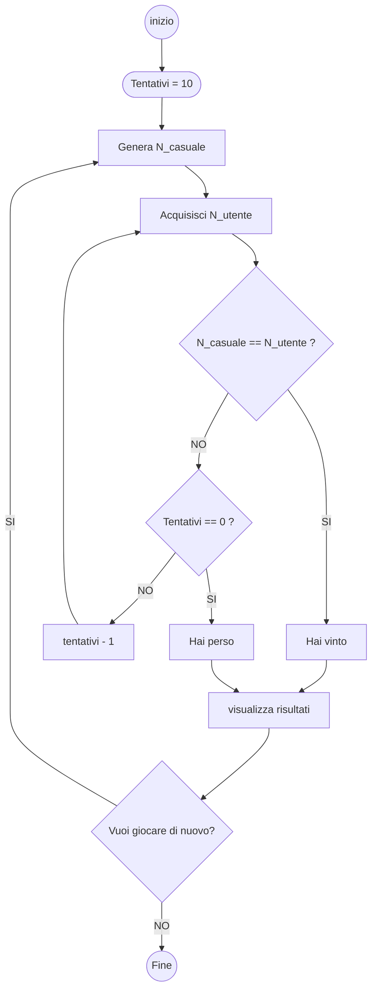

# INDOVINA NUMERO

## Obiettivo 

L'obiettivo di questa di questa applicazione è generare un **numero casuale** generato dal computer.

> Generazione numero casuale:
1. **new** è il costruttore della classe **Random();** che istanzia un oggetto **Random**.

2. **random** è l'oggetto Random che possiamo utilizzare per generare numeri casuali.

3. **.Next** è il metodo che genera un numero casuale.

4. L'intervallo del metodo .Next **è semi aperto** tra 1 e 101. Comprende il numero iniziale (1) ma esclude quello finale (101). Dunque l'intervallo è da 1 a 100 (99 numeri).

>**Esempio di codice per generazione numero casuale:** 
```csharp
Random random = new Random();
numeroDaIndovinare = random.Next(1,101);
```

## v1.1
Pulizia codice, console più pulita, formattazione più omogenea.

>Esempio codice:
```csharp
//******************************************************************************/
//                            INDOVINA NUMERO v1.1
/******************************************************************************/
Console.Clear();
Random random = new Random();
int numeroDaIndovinare = random.Next(1,101); 
int numeroTentativi = 10;
Console.Write($"Ho in mente un numero... Indovinalo! Hai {numeroTentativi} tentativi\n--> ");

while(true){
    int numeroUtente = int.Parse(Console.ReadLine());
//  int numeroUtente = Convert.ToInt32(Console.ReadLine()); conversione alternativa
    if (numeroUtente == numeroDaIndovinare){
        Console.WriteLine($"Hai indovinato! Avevo pensato proprio il {numeroDaIndovinare}");
        break;
    } else {    // <----- più probabilmente esegue da qui
        Console.Clear(); 
        numeroTentativi--;
        Console.WriteLine($"Mmm... Sbagliato :( Ora hai {numeroTentativi} tentativi...");
        Console.Write("--> ");

        if (numeroTentativi == 0){
            Console.Clear();
            Console.Write($"Mi dispiace... Il numero che avevo pensato era {numeroDaIndovinare}\n\n");
            break;
        }
    }
}
```

## v1.2
Possibilità di scegliere Facile (1-20), Medio (1-50), Difficile (1-100).

>Esempio di codice:
```csharp
/******************************************************************************/
//                            INDOVINA NUMERO v1.2
/******************************************************************************/

Console.Clear();
Random random = new Random();

 int numeroDaIndovinare = 0; // dichiarazione e inizializzazione variabile
 bool sceltaValida = false;

do{
    Console.WriteLine("Modalità di gioco:\n1 - Facile\n2 - Medio\n3 - Difficile");
    Console.Write("===>");
    int sceltaModalita = int.Parse(Console.ReadLine());

    switch (sceltaModalita){
        case 1:
            sceltaValida = true;
            numeroDaIndovinare = random.Next(1,21); 
            Console.Clear();
            Console.WriteLine("Modalità: Facile (penso a un numero tra 1 e 20)");
        break;
        case 2:
            sceltaValida = true;
            numeroDaIndovinare = random.Next(1,51); 
            Console.Clear();
            Console.WriteLine("Modalità: Medio (penso a un numero tra 1 e 50)");
        break;
        case 3:
            sceltaValida = true;
            numeroDaIndovinare = random.Next(1,101); 
            Console.Clear();
            Console.WriteLine("Modalità: Difficile (penso a un numero tra 1 e 100)");
        break;  
        default:
            sceltaValida = false;
            Console.Clear();
            Console.WriteLine("Questa modalità non esiste ancora :) Scegli una delle opzioni disponibili!\n");
        break;
    }
} while (sceltaValida == false);

Console.WriteLine("Istruzioni di gioco: Hai dieci tentativi per indovinare un numero che ho pensato... Cominciamo!\n");
Console.WriteLine("Premere un tasto per iniziare...");
Console.ReadKey();
int numeroTentativi = 10;
Console.Clear();
Console.Write($"Ho in mente un numero... Indovinalo! Hai {numeroTentativi} tentativi\n--> ");

while(true){
    int numeroUtente = int.Parse(Console.ReadLine());
//  int numeroUtente = Convert.ToInt32(Console.ReadLine()); conversione alternativa
    if (numeroUtente == numeroDaIndovinare){
        Console.WriteLine($"\nHai indovinato! Avevo pensato proprio al {numeroDaIndovinare}\n");
        break;
    } else {    // <----- più probabilmente esegue da qui
        Console.Clear(); 
        numeroTentativi--;
        Console.WriteLine($"Mmm... Sbagliato :( Ora hai {numeroTentativi} tentativi...");
        Console.Write("===> ");

        if (numeroTentativi == 0){
            Console.Clear();
            Console.Write($"Mi dispiace... Il numero che avevo pensato era {numeroDaIndovinare}\n\n");
            break;
        }
    }
}
```

## v1.3 + v1.4
### Obiettivo
Dopo 5 tentativi sbagliati propone 3 indizi (maggiore o minore / pari o dispari).

>Esempio di codice

```csharp
/******************************************************************************/
//                            INDOVINA NUMERO v1.3 + v1.4
/******************************************************************************/

using System.Security.Principal;

Console.Clear();
Random random = new Random();


 // Dichiarazione e inizializzazione
 int numeroDaIndovinare = 0; 
 bool sceltaValida = false;
 double intervallo = 0;

// Stampa e acquisisce Modalità di gioco
do{
    Console.WriteLine("Modalità di gioco:\n1 - Facile\n2 - Medio\n3 - Difficile");
    Console.Write("===>");
    int sceltaModalita = int.Parse(Console.ReadLine());

    switch (sceltaModalita){
        case 1:
            sceltaValida = true;
            numeroDaIndovinare = random.Next(1,21); 
            intervallo = 19;
            Console.Clear();
            Console.WriteLine("Modalità: Facile (penso a un numero tra 1 e 20)");
        break;
        case 2:
            sceltaValida = true;
            numeroDaIndovinare = random.Next(1,51); 
            intervallo = 49;
            Console.Clear();
            Console.WriteLine("Modalità: Medio (penso a un numero tra 1 e 50)");
        break;
        case 3:
            sceltaValida = true;
            numeroDaIndovinare = random.Next(1,101); 
            intervallo = 99;
            Console.Clear();
            Console.WriteLine("Modalità: Difficile (penso a un numero tra 1 e 100)");
        break;  
        default:
            sceltaValida = false;
            Console.Clear();
            Console.WriteLine("Questa modalità non esiste ancora :) Scegli una delle opzioni disponibili!\n");
        break;
    }
} while (sceltaValida == false);

//Stampa istruzioni di gioco
Console.WriteLine("Istruzioni di gioco: Hai 10 tentativi per indovinare un numero che ho pensato... Cominciamo!\n");
Console.WriteLine("Premere un tasto per iniziare...");
//Console.ReadKey();

// Dichiarazione e inizializzazione
int numeroTentativi = 10;

//Inizio sessione di gioco
Console.Clear();
Console.Write($"Ho in mente un numero... Indovinalo! Hai {numeroTentativi} tentativi\n--> ");

while(true){
    int numeroUtente = int.Parse(Console.ReadLine()); // Acquisizione 

    if (numeroUtente == numeroDaIndovinare){
        Console.WriteLine($"\nHai indovinato! Avevo pensato proprio al {numeroDaIndovinare}\n");
        break;
    } else {    // <----- La sessione di gioco si svolge qui
        
        numeroTentativi--; // Decremento tentativi

        Console.Clear(); 
        Console.WriteLine($"Mmm... Sbagliato :( Ora hai {numeroTentativi} tentativi...");

        int diffNumero = Math.Abs(numeroDaIndovinare - numeroUtente);

        if (diffNumero > intervallo / 2){
            Console.WriteLine("Indizio: Oceano!");
        } else if (diffNumero < intervallo / 2 && diffNumero > intervallo / 4 ){
            Console.WriteLine("Indizio: Acqua!");
        } else if (diffNumero < intervallo / 4){
            Console.WriteLine("Indizio: Fuoco!");
        }else if (diffNumero < intervallo / 10){
            Console.WriteLine("Indizio: Fuochissimo!");
        }
        
        if (numeroTentativi == 5) { // Indizio 5
            if (numeroDaIndovinare % 2 == 0) {{Console.WriteLine("Indizio: il numero che ho pensato è pari... :)");}}
            else {Console.WriteLine("Indizio: il numero che ho pensato è dispari... :)");}
        }

        if (numeroTentativi < 5 && numeroTentativi > 0){ // Indizio 4, 3, 2, 1
            if (numeroUtente > numeroDaIndovinare) {Console.WriteLine("Indizio: il numero che ho pensato è più basso... :)");}
            if (numeroUtente < numeroDaIndovinare) {Console.WriteLine("Indizio: il numero che ho pensato è più alto... :)");}
        }
        
        if (numeroTentativi == 0){  // Fine sessione di gioco
            Console.Clear();
            Console.Write($"Mi dispiace... Il numero che avevo pensato era {numeroDaIndovinare}\n\n");
            break;
        }

        Console.Write("===> ");
    }
}
```


Oceano (differenza > 50%), Acqua (25% > differenza < 50% )  Fuoco (differenza < 25%) Fuochissmo (differenza < 10%).

## v1.4b

### Obiettivo
Pulizia codice dai commenti. Controllo Exception per inserimento di un valore non valido, in ciclo do-while fino a inserimento corretto.

>Esempio di codice:
```csharp
/******************************************************************************/
//                            INDOVINA NUMERO v1.4b
/******************************************************************************/

using System.Security.Principal;

Console.Clear();
Random random = new Random();

 // Dichiarazione e inizializzazione
 int numeroDaIndovinare = 0; 
 bool sceltaValida = false;
 double intervallo = 0;

// Stampa e acquisisce Modalità di gioco
do{
    Console.WriteLine("Modalità di gioco:\n1 - Facile\n2 - Medio\n3 - Difficile");
    Console.Write("===>");
    int sceltaModalita = int.Parse(Console.ReadLine());

    switch (sceltaModalita){
        case 1:
            sceltaValida = true;
            numeroDaIndovinare = random.Next(1,21); 
            intervallo = 19; // da 1 a 20
            Console.Clear();
            Console.WriteLine("Modalità: Facile (penso a un numero tra 1 e 20)");
        break;
        case 2:
            sceltaValida = true;
            numeroDaIndovinare = random.Next(1,51); 
            intervallo = 49; // da 1 a 50
            Console.Clear();
            Console.WriteLine("Modalità: Medio (penso a un numero tra 1 e 50)");
        break;
        case 3:
            sceltaValida = true;
            numeroDaIndovinare = random.Next(1,101); 
            intervallo = 99; // da 1 a 100
            Console.Clear();
            Console.WriteLine("Modalità: Difficile (penso a un numero tra 1 e 100)");
        break;  
        default:
            sceltaValida = false;
            Console.Clear();
            Console.WriteLine("Questa modalità non esiste ancora :) Scegli una delle opzioni disponibili!\n");
        break;
    }
} while (sceltaValida == false);

//Stampa istruzioni di gioco
Console.WriteLine("Istruzioni di gioco: Hai 10 tentativi per indovinare un numero che ho pensato... Cominciamo!\n");
Console.WriteLine("Premere un tasto per iniziare...");
Console.ReadKey();

// Dichiarazione e inizializzazione tentativi
int numeroTentativi = 10;

//Inizio sessione di gioco
Console.Clear();
Console.Write($"Ho in mente un numero... Indovinalo! Hai {numeroTentativi} tentativi\n--> ");

while(true){
    int numeroUtente = int.Parse(Console.ReadLine()); // Acquisizione 

    // confronto numeri
    if (numeroUtente == numeroDaIndovinare){ // "Hai indovinato!" - Fine sessione con vittoria
        Console.WriteLine($"\nHai indovinato! Avevo pensato proprio al {numeroDaIndovinare}\n");
        break;
    } else {    // <----- "Sbagliato :(" - La sessione di gioco si svolge qui 
        
        numeroTentativi--; // Decremento tentativi

        Console.Clear(); 
        Console.WriteLine($"Mmm... Sbagliato :( Ora hai {numeroTentativi} tentativi...");

        int diffNumero = Math.Abs(numeroDaIndovinare - numeroUtente);

        if (diffNumero > intervallo / 2){ // differenza > 50% dell'intervallo (molto distanti)
            Console.WriteLine("Indizio: Oceano!");
        } else if (diffNumero < intervallo / 2 && diffNumero > intervallo / 4 ){ // differenza tra 50%  e 25% dell'intervallo (distanti)
            Console.WriteLine("Indizio: Acqua!"); 
        } else if (diffNumero < intervallo / 4){ // differenza < 25% intervallo (vicini)
            Console.WriteLine("Indizio: Fuoco!");
        }else if (diffNumero < intervallo / 10){ // differenza < 10% intervallo (molto vicini)
            Console.WriteLine("Indizio: Fuochissimo!");
        }
        
        if (numeroTentativi == 5) { // Indizio dopo 5 tentativi
            if (numeroDaIndovinare % 2 == 0) {{Console.WriteLine("Indizio: il numero che ho pensato è pari... :)");}}
            else {Console.WriteLine("Indizio: il numero che ho pensato è dispari... :)");}
        }

        if (numeroTentativi < 5 && numeroTentativi > 0){ // Indizio al tentativo 4, 3, 2, 1
            if (numeroUtente > numeroDaIndovinare) {Console.WriteLine("Indizio: il numero che ho pensato è più basso... :)");}
            if (numeroUtente < numeroDaIndovinare) {Console.WriteLine("Indizio: il numero che ho pensato è più alto... :)");}
        }
        
        // Fine sessione di gioco con sconfitta
        if (numeroTentativi == 0){  
            Console.Clear();
            Console.Write($"Mi dispiace... Il numero che avevo pensato era {numeroDaIndovinare}\n\n");
            break;
        }

        Console.Write("===> ");
    }
}
```

## v1.4c
### Obiettivo
* Implementazione file README.md.

* Visualizza numeri già tentati. 

> Esempio codice:

```csharp
/******************************************************************************/
//                            INDOVINA NUMERO v1.4c
/******************************************************************************/

using System.Security.Principal;

Console.Clear();
Random random = new Random();
 
 // Dichiarazione e inizializzazione
 int numeroDaIndovinare = 0; 
 bool sceltaValida = false;
 double intervallo = 0;
 int sceltaModalita = 0;
List<int> numeriTentati = new List<int>();

// Stampa e acquisisce Modalità di gioco
do{
    Console.WriteLine("Modalità di gioco:\n1 - Facile\n2 - Medio\n3 - Difficile");
    Console.Write("===>");

    do{
        try{
            sceltaModalita = int.Parse(Console.ReadLine());
            sceltaValida = true;
        }
        catch (System.FormatException){
            Console.WriteLine("Serve inserire un valore valido :( riprova...");
            Console.Write("===>");
            sceltaValida = false;
        }
    }while(sceltaValida==false);

    switch (sceltaModalita){
        case 1:
            sceltaValida = true;
            numeroDaIndovinare = random.Next(1,21); 
            intervallo = 19; // da 1 a 20
            Console.Clear();
            Console.WriteLine("Modalità: Facile (penso a un numero tra 1 e 20)");
        break;
        case 2:
            sceltaValida = true;
            numeroDaIndovinare = random.Next(1,51); 
            intervallo = 49; // da 1 a 50
            Console.Clear();
            Console.WriteLine("Modalità: Medio (penso a un numero tra 1 e 50)");
        break;
        case 3:
            sceltaValida = true;
            numeroDaIndovinare = random.Next(1,101); 
            intervallo = 99; // da 1 a 100
            Console.Clear();
            Console.WriteLine("Modalità: Difficile (penso a un numero tra 1 e 100)");
        break;  
        default:
            sceltaValida = false;
            Console.Clear();
            Console.WriteLine("Questa modalità non esiste ancora :) Scegli una delle opzioni disponibili!\n");
        break;
    }
} while (sceltaValida == false);

//Stampa istruzioni di gioco
Console.WriteLine("Istruzioni di gioco: Hai 10 tentativi per indovinare un numero che ho pensato... Cominciamo!\n");
Console.WriteLine("Premere un tasto per iniziare...");
Console.ReadKey();

// Dichiarazione e inizializzazione tentativi
int numeroTentativi = 10;
int numeroUtente = 0;

//Inizio sessione di gioco
Console.Clear();
Console.Write($"Ho in mente un numero... Indovinalo! Hai {numeroTentativi} tentativi\n--> ");

while(true){
     //numeroUtente = int.Parse(Console.ReadLine()); // Acquisizione 


    do{
        try{
            numeroUtente = int.Parse(Console.ReadLine());
            sceltaValida = true;
        }
        catch (System.FormatException){
            Console.WriteLine("Serve inserire un valore valido :( riprova...");
            Console.Write("===>");
            sceltaValida = false;
        }
    }while(sceltaValida==false);


    // confronto numeri
    if (numeroUtente == numeroDaIndovinare){ // "Hai indovinato!" - Fine sessione con vittoria
        Console.WriteLine($"\nHai indovinato! Avevo pensato proprio al {numeroDaIndovinare}\n");
        break;
    } else {    // <----- "Sbagliato :(" - La sessione di gioco si svolge qui 
        
        

        numeroTentativi--; // Decremento tentativi

        Console.Clear(); 
        Console.WriteLine($"Mmm... Sbagliato :( Ora hai {numeroTentativi} tentativi...");

        numeriTentati.Add(numeroUtente);
        Console.Write("I tuoi numeri (");
        Console.Write(string.Join(", ", numeriTentati));
        int diffNumero = Math.Abs(numeroDaIndovinare - numeroUtente);
        Console.Write(")\n");

        if (diffNumero > intervallo / 2){ // differenza > 50% dell'intervallo (molto distanti)
            Console.WriteLine("Indizio: Oceano!");
        } else if (diffNumero < intervallo / 2 && diffNumero > intervallo / 4 ){ // differenza tra 50%  e 25% dell'intervallo (distanti)
            Console.WriteLine("Indizio: Acqua!"); 
        } else if (diffNumero < intervallo / 4){ // differenza < 25% intervallo (vicini)
            Console.WriteLine("Indizio: Fuoco!");
        }else if (diffNumero < intervallo / 10){ // differenza < 10% intervallo (molto vicini)
            Console.WriteLine("Indizio: Fuochissimo!");
        }
        
        if (numeroTentativi == 5) { // Indizio dopo 5 tentativi
            if (numeroDaIndovinare % 2 == 0) {{Console.WriteLine("Indizio: il numero che ho pensato è pari... :)");}}
            else {Console.WriteLine("Indizio: il numero che ho pensato è dispari... :)");}
        }

        if (numeroTentativi < 5 && numeroTentativi > 0){ // Indizio al tentativo 4, 3, 2, 1
            if (numeroUtente > numeroDaIndovinare) {Console.WriteLine("Indizio: il numero che ho pensato è più basso... :)");}
            if (numeroUtente < numeroDaIndovinare) {Console.WriteLine("Indizio: il numero che ho pensato è più alto... :)");}
        }
        
        // Fine sessione di gioco con sconfitta
        if (numeroTentativi == 0){  
            Console.Clear();
            Console.Write($"Mi dispiace... Il numero che avevo pensato era {numeroDaIndovinare}\n\n");
            break;
        }

        Console.Write("===> ");
    }
}
```

> Commit:
```powershell

git add --all
git commit -m "Indovina Numero v1.4c"
git push -u origin main

```


## v1.5

### Obiettivo:
Sistema di punteggio

#### Sistema di punteggio: 

* Sistema di punteggio semplificato (20 punti, ogni errore -1 punto)

> Esempio codice:

```csharp 
/******************************************************************************/
//                            INDOVINA NUMERO v1.5
/******************************************************************************/

using System.Security.Principal;

Console.Clear();
Random random = new Random();
 
// Dichiarazione e inizializzazione
int numeroDaIndovinare = 0; 
bool sceltaValida = false;
double intervallo = 0;
int sceltaModalita = 0;
int punteggioGiocatore = 0;
List<int> numeriTentati = new List<int>();

// Ciclo di controllo inserimento modalità di gioco
do{ 
    // Stampa Modalità di gioco
    Console.WriteLine("Modalità di gioco:\n1 - Facile\n2 - Medio\n3 - Difficile");
    Console.Write("===>");

    // Acquisizione Modalità di gioco e controllo validità inserimento
    do{
        try{
            sceltaModalita = int.Parse(Console.ReadLine());
            sceltaValida = true;
        }
        catch (System.FormatException){
            Console.WriteLine("Serve inserire un valore valido :( riprova...");
            Console.Write("===>");
            sceltaValida = false;
        }
    }while(sceltaValida==false);

    // Stampo e imposto la modalità (Facile, Medio, Difficile)
    switch (sceltaModalita){
        case 1:
            sceltaValida = true;
            numeroDaIndovinare = random.Next(1,21); 
            intervallo = 19;
            Console.Clear();
            Console.WriteLine("Modalità: Facile (penso a un numero tra 1 e 20)");
        break;
        case 2:
            sceltaValida = true;
            numeroDaIndovinare = random.Next(1,51); 
            intervallo = 49;
            Console.Clear();
            Console.WriteLine("Modalità: Medio (penso a un numero tra 1 e 50)");
        break;
        case 3:
            sceltaValida = true;
            numeroDaIndovinare = random.Next(1,101); 
            intervallo = 99; 
            Console.Clear();
            Console.WriteLine("Modalità: Difficile (penso a un numero tra 1 e 100)");
        break;  
        default:
            sceltaValida = false;
            Console.Clear();
            Console.WriteLine("Questa modalità non esiste ancora :) Scegli una delle opzioni disponibili!\n");
        break;
    }
} while (sceltaValida == false);
// FINE Ciclo di controllo inserimento modalità di gioco

//Stampa istruzioni di gioco
Console.WriteLine("Istruzioni di gioco: Hai 10 tentativi per indovinare un numero che ho pensato... Cominciamo!\n");
Console.WriteLine("Premere un tasto per iniziare...");
Console.ReadKey();

//Inizio sessione di gioco   <==========================

// Dichiarazione e inizializzazione tentativi
int numeroTentativi = 10;
int numeroUtente = 0;

Console.Clear();
Console.Write($"Ho in mente un numero... Indovinalo! Hai {numeroTentativi} tentativi\n--> ");

// Ciclo sessioni di gioco
while(true){  

    // Acquisizione numeroUtente e controllo validità
    do{
        try{
            numeroUtente = int.Parse(Console.ReadLine());
            sceltaValida = true;
        }
        catch (System.FormatException){
            Console.WriteLine("Serve inserire un valore valido :( riprova...");
            Console.Write("===>");
            sceltaValida = false;
        }
    }while(sceltaValida==false);
    // FINE Acquisizione numeroUtente e controllo validità

    // Confronto numeri - UGUALE
    if (numeroUtente == numeroDaIndovinare){ 
        // Stampa messaggio - "Hai indovinato!" - Fine sessione con vittoria
        Console.WriteLine($"\nHai indovinato! Avevo pensato proprio al {numeroDaIndovinare}\n");
        punteggioGiocatore += numeroTentativi*10;
        break;

    // Confronto numero - DIVERSO - 
    // **** La sessione di gioco si svolge qui ****
    } else {     

        // Decremento tentativi
        numeroTentativi--; 

        // Stampa messaggio  "Sbagliato :(" 
        Console.Clear(); 
        Console.WriteLine($"Mmm... Sbagliato :( Ora hai {numeroTentativi} tentativi...");

        // Aggiungi numero alla lista dei numeri tentati e stampa 
        numeriTentati.Add(numeroUtente);
        Console.Write("I tuoi numeri (");
        Console.Write(string.Join(", ", numeriTentati));
        Console.Write(")\n");

        // Calcolo Differenza 
        int diffNumero = Math.Abs(numeroDaIndovinare - numeroUtente);
        

        if (diffNumero > intervallo / 2){                                           // differenza > 50% dell'intervallo (molto distanti)
            Console.WriteLine("Indizio: Oceano!");
        } else if (diffNumero < intervallo / 2 && diffNumero > intervallo / 4 ){    // differenza tra 50%  e 25% dell'intervallo (distanti)
            Console.WriteLine("Indizio: Acqua!"); 
        } else if (diffNumero < intervallo / 4){                                    // differenza < 25% intervallo (vicini)
            Console.WriteLine("Indizio: Fuoco!");
        }else if (diffNumero < intervallo / 10){                                    // differenza < 10% intervallo (molto vicini)
            Console.WriteLine("Indizio: Fuochissimo!");
        }
        
        // Indizio dopo 5 tentativi
        if (numeroTentativi == 5) {     
            if (numeroDaIndovinare % 2 == 0) {{Console.WriteLine("Indizio: il numero che ho pensato è pari... :)");}}
            else {Console.WriteLine("Indizio: il numero che ho pensato è dispari... :)");}
        }

        // Indizio al tentativo 4, 3, 2, 1
        if (numeroTentativi < 5 && numeroTentativi > 0){ 
            if (numeroUtente > numeroDaIndovinare) {Console.WriteLine("Indizio: il numero che ho pensato è più basso... :)");}
            if (numeroUtente < numeroDaIndovinare) {Console.WriteLine("Indizio: il numero che ho pensato è più alto... :)");}
        }
        
        // Solo quando finiscono i tentativi: Sconfitta
        if (numeroTentativi == 0){  
            Console.Clear();
            Console.Write($"Mi dispiace... Il numero che avevo pensato era {numeroDaIndovinare}\n\n");
            break;
        }

        // Stampa indicatore inserimento
        Console.Write("===> ");
    }
}

Console.WriteLine($"Hai totalizzato {punteggioGiocatore} punti");
Console.WriteLine("Premi un tasto per terminare la sessione di gioco...");
Console.ReadKey();
```

> Commit:
```powershell
git add --all
git commit -m "Indovina Numero v1.5"
git push -u origin main
```

## v1.5b

### Obiettivo
Sistema di punteggio semplificato (20 punti, ogni errore -1 punto)


>Esempio di codice 

```csharp
/******************************************************************************/
//                            INDOVINA NUMERO v1.5b
/******************************************************************************/

// punteggio alternativo

using System.Security.Principal;

Console.Clear();
Random random = new Random();
 
// Dichiarazione e inizializzazione
int numeroDaIndovinare = 0; 
bool sceltaValida = false;
double intervallo = 0;
int sceltaModalita = 0;
int punteggioGiocatore = 20;
List<int> numeriTentati = new List<int>();

// Ciclo di controllo inserimento modalità di gioco
do{ 
    // Stampa Modalità di gioco
    Console.WriteLine("Modalità di gioco:\n1 - Facile\n2 - Medio\n3 - Difficile");
    Console.Write("===>");

    // Acquisizione Modalità di gioco e controllo validità inserimento
    do{
        try{
            sceltaModalita = int.Parse(Console.ReadLine());
            sceltaValida = true;
        }
        catch (System.FormatException){
            Console.WriteLine("Serve inserire un valore valido :( riprova...");
            Console.Write("===>");
            sceltaValida = false;
        }
    }while(sceltaValida==false);

    // Stampo e imposto la modalità (Facile, Medio, Difficile)
    switch (sceltaModalita){
        case 1:
            sceltaValida = true;
            numeroDaIndovinare = random.Next(1,21); 
            intervallo = 19;
            Console.Clear();
            Console.WriteLine("Modalità: Facile (penso a un numero tra 1 e 20)");
        break;
        case 2:
            sceltaValida = true;
            numeroDaIndovinare = random.Next(1,51); 
            intervallo = 49;
            Console.Clear();
            Console.WriteLine("Modalità: Medio (penso a un numero tra 1 e 50)");
        break;
        case 3:
            sceltaValida = true;
            numeroDaIndovinare = random.Next(1,101); 
            intervallo = 99; 
            Console.Clear();
            Console.WriteLine("Modalità: Difficile (penso a un numero tra 1 e 100)");
        break;  
        default:
            sceltaValida = false;
            Console.Clear();
            Console.WriteLine("Questa modalità non esiste ancora :) Scegli una delle opzioni disponibili!\n");
        break;
    }
} while (sceltaValida == false);
// FINE Ciclo di controllo inserimento modalità di gioco

//Stampa istruzioni di gioco
Console.WriteLine("Istruzioni di gioco: Hai 10 tentativi per indovinare un numero che ho pensato... Cominciamo!\n");
Console.WriteLine("Premere un tasto per iniziare...");
Console.ReadKey();

//Inizio sessione di gioco   <==========================

// Dichiarazione e inizializzazione tentativi
int numeroTentativi = 10;
int numeroUtente = 0;

Console.Clear();
Console.Write($"Ho in mente un numero... Indovinalo! Hai {numeroTentativi} tentativi\n--> ");

// Ciclo sessioni di gioco
while(true){  

    // Acquisizione numeroUtente e controllo validità
    do{
        try{
            numeroUtente = int.Parse(Console.ReadLine());
            sceltaValida = true;
        }
        catch (System.FormatException){
            Console.WriteLine("Serve inserire un valore valido :( riprova...");
            Console.Write("===>");
            sceltaValida = false;
        }
    }while(sceltaValida==false);
    // FINE Acquisizione numeroUtente e controllo validità

    // Confronto numeri ---> UGUALE
    if (numeroUtente == numeroDaIndovinare){ 
        // Stampa messaggio - "Hai indovinato!" - Fine sessione con vittoria
        Console.WriteLine($"\nHai indovinato! Avevo pensato proprio al {numeroDaIndovinare}\n");
        //punteggioGiocatore += numeroTentativi*10;
        break;

    // Confronto numero ---> DIVERSO 
    // La sessione di gioco si svolge qui <==========================
    } else {     

        // Decremento tentativi
        numeroTentativi--; 

        // Decremento punteggio
        punteggioGiocatore--;

        // Stampa messaggio  "Sbagliato :(" 
        Console.Clear(); 
        Console.WriteLine($"Punteggio: {punteggioGiocatore}\n");
        Console.WriteLine($"Mmm... Sbagliato :( Ora hai {numeroTentativi} tentativi...");

        // Aggiungi numero alla lista dei numeri tentati e stampa 
        numeriTentati.Add(numeroUtente);
        Console.Write("I tuoi numeri (");
        Console.Write(string.Join(", ", numeriTentati));
        Console.Write(")\n");

        // Calcolo Differenza 
        int diffNumero = Math.Abs(numeroDaIndovinare - numeroUtente);
        
        if (diffNumero > intervallo / 2){                                           // differenza > 50% dell'intervallo (molto distanti)
            Console.WriteLine("Indizio: Oceano!");
        } else if (diffNumero < intervallo / 2 && diffNumero > intervallo / 4 ){    // differenza tra 50%  e 25% dell'intervallo (distanti)
            Console.WriteLine("Indizio: Acqua!"); 
        } else if (diffNumero < intervallo / 4){                                    // differenza < 25% intervallo (vicini)
            Console.WriteLine("Indizio: Fuoco!");
        }else if (diffNumero < intervallo / 10){                                    // differenza < 10% intervallo (molto vicini)
            Console.WriteLine("Indizio: Fuochissimo!");
        }
        
        // Indizio dopo 5 tentativi
        if (numeroTentativi == 5) {     
            if (numeroDaIndovinare % 2 == 0) {{Console.WriteLine("Indizio: il numero che ho pensato è pari... :)");}}
            else {Console.WriteLine("Indizio: il numero che ho pensato è dispari... :)");}
        }

        // Indizio al tentativo 4, 3, 2, 1
        if (numeroTentativi < 5 && numeroTentativi > 0){ 
            if (numeroUtente > numeroDaIndovinare) {Console.WriteLine("Indizio: il numero che ho pensato è più basso... :)");}
            if (numeroUtente < numeroDaIndovinare) {Console.WriteLine("Indizio: il numero che ho pensato è più alto... :)");}
        }
        
        // Solo quando finiscono i tentativi: Sconfitta
        if (numeroTentativi == 0){  
            Console.Clear();
            Console.Write($"Mi dispiace... Il numero che avevo pensato era {numeroDaIndovinare}\n\n");
            break;
        }

        // Stampa indicatore inserimento
        Console.Write("===> ");
    }
}

Console.WriteLine($"Hai totalizzato {punteggioGiocatore} punti");
Console.WriteLine("Premi un tasto per terminare la sessione di gioco...");
Console.ReadKey();
```
> Commit:
```powershell
git add --all
git commit -m "Indovina Numero v1.5b"
git push -u origin main
```

## v1.6

### Obiettivo

* Prolungare la sessione di gioco a 3 Round (ho usato ciclo do while con bool fineRound come flag)
* Sistema di punteggio avanzato: quando si indovina un numero, i tentativi rimasti vengono moltiplicati per x10 e sommati alla variabile int punteggioGiocatore 
* Visualizzazione dei punti fatti alla fine di ogni round
* Visualizzazione somma dei punti a fine sessione
* Controllo inserimento valido, sia per la scelta della modalità, che per il range scelto (esempio: 1-20, se inserirsco 21 mi fa reinserire un valore valido)

>Esempio codice:
```csharp
/******************************************************************************/
//                            INDOVINA NUMERO v1.6
/******************************************************************************/

// punteggio alternativo

using System.Security.Principal;

Console.Clear();
Random random = new Random();

// Dichiarazione e inizializzazione
int numeroDaIndovinare = 0;
bool sceltaValida = false;
double intervallo = 0;
int sceltaModalita = 0;
int punteggioGiocatore = 0;
int punteggioTemp = 0;
int nRound = 0;
bool fineRound = false;
List<int> numeriTentati = new List<int>();

// Ciclo di controllo inserimento modalità di gioco
do
{
    // Stampa Modalità di gioco
    Console.WriteLine("Modalità di gioco:\n1 - Facile\n2 - Medio\n3 - Difficile");
    Console.Write("===>");

    // Acquisizione Modalità di gioco e controllo validità inserimento
    /*
    do
    {
        try
        {
            sceltaModalita = int.Parse(Console.ReadLine());
            sceltaValida = true;
        }
        catch (System.FormatException)
        {
            Console.WriteLine("Serve inserire un valore valido :( riprova...");
            Console.Write("===>");
            sceltaValida = false;
        }
    } while (sceltaValida == false);
    */
    do{
        bool successo = int.TryParse(Console.ReadLine(), out sceltaModalita);
        if(successo == true){
            sceltaValida = true;
        }
        else{
            Console.WriteLine("Serve inserire un valore valido :( riprova...");
                Console.Write("===>");
                sceltaValida = false;
        }
    }while(sceltaValida==false);

    // Stampo e imposto la modalità (Facile, Medio, Difficile)
    switch (sceltaModalita)
    {
        case 1:
            sceltaValida = true;
            Console.Clear();
            Console.WriteLine("Modalità: Facile (penso a un numero tra 1 e 20)");
            break;
        case 2:
            sceltaValida = true;
            Console.Clear();
            Console.WriteLine("Modalità: Medio (penso a un numero tra 1 e 50)");
            break;
        case 3:
            sceltaValida = true;
            Console.Clear();
            Console.WriteLine("Modalità: Difficile (penso a un numero tra 1 e 100)");
            break;
        default:
            sceltaValida = false;
            Console.Clear();
            Console.WriteLine("Questa modalità non esiste ancora :) Scegli una delle opzioni disponibili!\n");
            break;
    }
} while (sceltaValida == false);
// FINE Ciclo di controllo inserimento modalità di gioco

do
{
    switch (sceltaModalita)
    {
        case 1:
            numeroDaIndovinare = random.Next(1, 21);
            intervallo = 19;
            break;
        case 2:
            
            numeroDaIndovinare = random.Next(1, 51);
            intervallo = 49;
            break;
        case 3: 
            numeroDaIndovinare = random.Next(1, 101);
            intervallo = 99;
            break;
        default:
            break;
    }

    Console.WriteLine($"*** Round {nRound+1} ***");
    Console.WriteLine("Premi un tasto per continuare...");
    Console.ReadKey();
    Console.Clear();


    //Stampa istruzioni di gioco
    Console.WriteLine("Istruzioni di gioco: Hai 10 tentativi per indovinare un numero che ho pensato... Cominciamo!\n");
    Console.WriteLine("Premere un tasto per iniziare...");
    Console.ReadKey();

    //Inizio sessione di gioco   <==========================

    // Dichiarazione e inizializzazione tentativi
    int numeroTentativi = 10;
    int numeroUtente = 0;

    Console.Clear();
    Console.Write($"Ho in mente un numero... Indovinalo! Hai {numeroTentativi} tentativi\n--> ");

    // Ciclo sessioni di gioco
    while (true)
    {

        // Acquisizione numeroUtente e controllo validità
        do
        {
            /*
            try
            {
                numeroUtente = int.Parse(Console.ReadLine());
                sceltaValida = true;
            }
            catch (System.FormatException)
            {
                Console.WriteLine("Serve inserire un valore valido :( riprova...");
                Console.Write("===>");
                sceltaValida = false;
            }
            */
            bool successoNumeroUtente = int.TryParse(Console.ReadLine(),out numeroUtente);
            if (successoNumeroUtente == true && numeroUtente >= 1 && numeroUtente <= intervallo+1){
                sceltaValida = true;
            }else{
                Console.WriteLine("Serve inserire un valore valido :( riprova...");
                Console.Write("===>");
                sceltaValida = false;
            }

        } while (sceltaValida == false);
        // FINE Acquisizione numeroUtente e controllo validità

        // Confronto numeri ---> UGUALE
        if (numeroUtente == numeroDaIndovinare)
        {
            // Stampa messaggio - "Hai indovinato!" - Fine sessione con vittoria
            Console.WriteLine($"\nHai indovinato! Avevo pensato proprio al {numeroDaIndovinare}\n");
            punteggioTemp += numeroTentativi * 10;
            break;

            // Confronto numero ---> DIVERSO 
            // La sessione di gioco si svolge qui <==========================
        }
        else
        {

            // Decremento tentativi
            numeroTentativi--;

            // Decremento punteggio
            //punteggioGiocatore--;

            // Stampa messaggio  "Sbagliato :(" 
            Console.Clear();
            Console.WriteLine($"Punteggio: {punteggioGiocatore}\n");
            Console.WriteLine($"Mmm... Sbagliato :( Ora hai {numeroTentativi} tentativi...");

            // Aggiungi numero alla lista dei numeri tentati e stampa 
            numeriTentati.Add(numeroUtente);
            Console.Write("I tuoi numeri (");
            Console.Write(string.Join(", ", numeriTentati));
            Console.Write(")\n");

            // Calcolo Differenza 
            int diffNumero = Math.Abs(numeroDaIndovinare - numeroUtente);

            if (diffNumero > intervallo / 2)
            {                                           // differenza > 50% dell'intervallo (molto distanti)
                Console.WriteLine("Indizio: Oceano!");
            }
            else if (diffNumero < intervallo / 2 && diffNumero > intervallo / 4)
            {    // differenza tra 50%  e 25% dell'intervallo (distanti)
                Console.WriteLine("Indizio: Acqua!");
            }
            else if (diffNumero < intervallo / 4)
            {                                    // differenza < 25% intervallo (vicini)
                Console.WriteLine("Indizio: Fuoco!");
            }
            else if (diffNumero < intervallo / 10)
            {                                    // differenza < 10% intervallo (molto vicini)
                Console.WriteLine("Indizio: Fuochissimo!");
            }

            // Indizio dopo 5 tentativi
            if (numeroTentativi == 5)
            {
                if (numeroDaIndovinare % 2 == 0) { { Console.WriteLine("Indizio: il numero che ho pensato è pari... :)"); } }
                else { Console.WriteLine("Indizio: il numero che ho pensato è dispari... :)"); }
            }

            // Indizio al tentativo 4, 3, 2, 1
            if (numeroTentativi < 5 && numeroTentativi > 0)
            {
                if (numeroUtente > numeroDaIndovinare) { Console.WriteLine("Indizio: il numero che ho pensato è più basso... :)"); }
                if (numeroUtente < numeroDaIndovinare) { Console.WriteLine("Indizio: il numero che ho pensato è più alto... :)"); }
            }

            // Solo quando finiscono i tentativi: Sconfitta
            if (numeroTentativi == 0)
            {
                Console.Clear();
                Console.Write($"Mi dispiace... Il numero che avevo pensato era {numeroDaIndovinare}\n\n");
                break;
            }

            // Stampa indicatore inserimento
            Console.Write("===> ");
        }
    }

    Console.WriteLine($"Hai totalizzato {punteggioTemp} punti nel {nRound+1}^ round");
    Console.WriteLine("Premi un tasto per continuare...");
    Console.ReadKey();
    Console.Clear();
    punteggioGiocatore += punteggioTemp;
    punteggioTemp = 0;
    numeriTentati.Clear();

    nRound++;
    if (nRound == 3)
    {
        fineRound = true;
    }

} while (fineRound == false);


Console.WriteLine($"Fine del gioco! Hai totalizzato {punteggioGiocatore}");
Console.WriteLine("Premi un tasto per terminare la sessione di gioco...");
Console.ReadKey();
```

```bash
git add --all
git commit -m "Indovina Numero v1.6"
git push -u origin main
```

## v1.7

### Obiettivo

Creare un Menù con:
- Chiedi all'utente se l'utente vuole giocare di nuovo

**Istruzioni:**
- Se l'utente risponde "s" o S", il gioco ricomincia. Se l'utente risponde "n" o "N" il gioco termina.

>Esempio codice:
```csharp
/******************************************************************************/
//                            INDOVINA NUMERO v1.7
/******************************************************************************/

using System.Security.Principal;

Console.Clear();
Random random = new Random();

// Dichiarazione e inizializzazione
int numeroDaIndovinare = 0;
bool sceltaValida = false;
double intervallo = 0;
int sceltaModalita = 0;
int punteggioGiocatore = 0;
int punteggioTemp = 0;
int nRound = 0;
bool fineRound = false;
string risposta = "";
List<int> numeriTentati = new List<int>();


do{ // Gioca

    Console.Clear();

    Console.WriteLine("****************************************");
    Console.WriteLine("             INDOVINA NUMERO!");
    Console.Write("\n****************************************");

    Console.ReadKey();
    Console.Clear();

// Gestione Modalità
    do
    {
        // Stampa Modalità di gioco
        Console.WriteLine("Modalità di gioco:\n1 - Facile\n2 - Medio\n3 - Difficile");
        Console.Write("===>");

        // Acquisizione Modalità di gioco e controllo validità inserimento
        /*
        do
        {
            try
            {
                sceltaModalita = int.Parse(Console.ReadLine());
                sceltaValida = true;
            }
            catch (System.FormatException)
            {
                Console.WriteLine("Serve inserire un valore valido :( riprova...");
                Console.Write("===>");
                sceltaValida = false;
            }
        } while (sceltaValida == false);
        */
        do{
            bool successo = int.TryParse(Console.ReadLine(), out sceltaModalita);
            if(successo == true){
                sceltaValida = true;
            }
            else{
                Console.WriteLine("Serve inserire un valore valido :( riprova...");
                    Console.Write("===>");
                    sceltaValida = false;
            }
        }while(sceltaValida==false);

        // Stampo e imposto la modalità (Facile, Medio, Difficile)
        switch (sceltaModalita)
        {
            case 1:
                sceltaValida = true;
                Console.Clear();
                Console.WriteLine("Modalità: Facile (penso a un numero tra 1 e 20)");
                break;
            case 2:
                sceltaValida = true;
                Console.Clear();
                Console.WriteLine("Modalità: Medio (penso a un numero tra 1 e 50)");
                break;
            case 3:
                sceltaValida = true;
                Console.Clear();
                Console.WriteLine("Modalità: Difficile (penso a un numero tra 1 e 100)");
                break;
            default:
                sceltaValida = false;
                Console.Clear();
                Console.WriteLine("Questa modalità non esiste ancora :) Scegli una delle opzioni disponibili!\n");
                break;
        }
    } while (sceltaValida == false);

// Sessione di Gioco (3 Round)
    do
    {
        switch (sceltaModalita)
        {
            case 1:
                numeroDaIndovinare = random.Next(1, 21);
                intervallo = 19;
                break;
            case 2:
                
                numeroDaIndovinare = random.Next(1, 51);
                intervallo = 49;
                break;
            case 3: 
                numeroDaIndovinare = random.Next(1, 101);
                intervallo = 99;
                break;
            default:
                break;
        }

        // Console.WriteLine(numeroDaIndovinare); // Esponi numero da indovinare per Debug
        Console.WriteLine($"*** Round {nRound+1} ***");
        Console.WriteLine("Premi un tasto per continuare...");
        Console.ReadKey();
        Console.Clear();


        //Stampa istruzioni di gioco
        Console.WriteLine("Istruzioni di gioco: Hai 10 tentativi per indovinare un numero che ho pensato... Cominciamo!\n");
        Console.WriteLine("Premere un tasto per iniziare...");
        Console.ReadKey();

        //Inizio sessione di gioco   <==========================

        // Dichiarazione e inizializzazione tentativi
        int numeroTentativi = 10;
        int numeroUtente = 0;

        Console.Clear();
        Console.Write($"Ho in mente un numero... Indovinalo! Hai {numeroTentativi} tentativi\n--> ");

        // Ciclo sessioni di gioco
        while (true)
        {

            // Acquisizione numeroUtente e controllo validità
            do
            {
                /*
                try
                {
                    numeroUtente = int.Parse(Console.ReadLine());
                    sceltaValida = true;
                }
                catch (System.FormatException)
                {
                    Console.WriteLine("Serve inserire un valore valido :( riprova...");
                    Console.Write("===>");
                    sceltaValida = false;
                }
                */
                bool successoNumeroUtente = int.TryParse(Console.ReadLine(),out numeroUtente);
                if (successoNumeroUtente == true && numeroUtente >= 1 && numeroUtente <= intervallo+1){
                    sceltaValida = true;
                }else{
                    Console.WriteLine("Serve inserire un valore valido :( riprova...");
                    Console.Write("===>");
                    sceltaValida = false;
                }

            } while (sceltaValida == false);
            // FINE Acquisizione numeroUtente e controllo validità

            // Confronto numeri ---> UGUALE
            if (numeroUtente == numeroDaIndovinare)
            {
                // Stampa messaggio - "Hai indovinato!" - Fine sessione con vittoria
                Console.WriteLine($"\nHai indovinato! Avevo pensato proprio al {numeroDaIndovinare}\n");
                punteggioTemp += numeroTentativi * 10;
                break;

                // Confronto numero ---> DIVERSO 
                // La sessione di gioco si svolge qui <==========================
            }
            else
            {

                // Decremento tentativi
                numeroTentativi--;

                // Decremento punteggio
                //punteggioGiocatore--;

                // Stampa messaggio  "Sbagliato :(" 
                Console.Clear();
                //Console.WriteLine($"Punteggio: {punteggioGiocatore}\n");
                Console.WriteLine($"Mmm... Sbagliato :( Ora hai {numeroTentativi} tentativi...");

                // Aggiungi numero alla lista dei numeri tentati e stampa 
                numeriTentati.Add(numeroUtente);
                Console.Write("I tuoi numeri (");
                Console.Write(string.Join(", ", numeriTentati));
                Console.Write(")\n");

                // Calcolo Differenza 
                int diffNumero = Math.Abs(numeroDaIndovinare - numeroUtente);

                if (diffNumero > intervallo / 2)
                {                                           // differenza > 50% dell'intervallo (molto distanti)
                    Console.WriteLine("Indizio: Oceano!");
                }
                else if (diffNumero < intervallo / 2 && diffNumero > intervallo / 4)
                {    // differenza tra 50%  e 25% dell'intervallo (distanti)
                    Console.WriteLine("Indizio: Acqua!");
                }
                else if (diffNumero < intervallo / 4 && diffNumero > intervallo / 10)
                {                                    // differenza < 25% intervallo (vicini)
                    Console.WriteLine("Indizio: Fuoco!");
                }
                else if (diffNumero < intervallo / 10)
                {                                    // differenza < 10% intervallo (molto vicini)
                    Console.WriteLine("Indizio: Fuochissimo!");
                }

                // Indizio dopo 5 tentativi
                if (numeroTentativi == 5)
                {
                    if (numeroDaIndovinare % 2 == 0) { { Console.WriteLine("Indizio: il numero che ho pensato è pari... :)"); } }
                    else { Console.WriteLine("Indizio: il numero che ho pensato è dispari... :)"); }
                }

                // Indizio al tentativo 4, 3, 2, 1
                if (numeroTentativi < 5 && numeroTentativi > 0)
                {
                    if (numeroUtente > numeroDaIndovinare) { Console.WriteLine("Indizio: il numero che ho pensato è più basso... :)"); }
                    if (numeroUtente < numeroDaIndovinare) { Console.WriteLine("Indizio: il numero che ho pensato è più alto... :)"); }
                }

                // Solo quando finiscono i tentativi: Sconfitta
                if (numeroTentativi == 0)
                {
                    Console.Clear();
                    Console.Write($"Mi dispiace... Il numero che avevo pensato era {numeroDaIndovinare}\n\n");
                    break;
                }

                // Stampa indicatore inserimento
                Console.Write("===> ");
            }
        }

        Console.WriteLine($"Hai totalizzato {punteggioTemp} punti nel {nRound+1}^ round");
        Console.WriteLine("Premi un tasto per continuare...");
        Console.ReadKey();
        Console.Clear();
        punteggioGiocatore += punteggioTemp;
        punteggioTemp = 0;
        numeriTentati.Clear();

        nRound++;
        if (nRound == 3)
        {
            fineRound = true;
        }

    } while (fineRound == false);

// Fine dei Round
    Console.WriteLine($"Fine del gioco! Hai totalizzato {punteggioGiocatore} punti");
    Console.WriteLine("Vuoi giocare di nuovo? s/n");
    
    risposta = Console.ReadLine();

    while (risposta != "s" && risposta != "S" && risposta != "n" && risposta != "N")
    {
        Console.Clear();
        Console.WriteLine("Risposta non valida :(");
        Console.WriteLine("Vuoi giocare di nuovo? s/n");
        risposta = Console.ReadLine();
    }

    risposta = risposta.ToUpper();
    nRound = 0;
    fineRound = false;
    numeriTentati.Clear();
    punteggioGiocatore = 0;
    punteggioTemp = 0;
    
} while (risposta == "S");
Console.Clear();
Console.WriteLine("Grazie per aver giocato!");
Console.ReadKey();
```
**Comandi Versionamento**

```bash
git add --all
git commit -m "Indovina Numero v1.7"
git push -u origin main
```
## V1.8
### Obiettivo:
Aggiungere sezione SCORE, dove alla fine dei tre round il player inserisce il proprio nome, che verrà memorizzato in una variabile Dizionario associandolo al punteggio. 

>Esempio di codice:
```csharp
/******************************************************************************/
//                            INDOVINA NUMERO v1.8
/******************************************************************************/

using System.Security.Principal;

Console.Clear();
Random random = new Random();

// Dichiarazione e inizializzazione
int numeroDaIndovinare = 0;
bool sceltaValida = false;
double intervallo = 0;
int sceltaModalita = 0;
int punteggioGiocatore = 0;
int punteggioTemp = 0;
int nRound = 0;
bool fineRound = false;
string risposta = "";
List<int> numeriTentati = new List<int>();
Dictionary<string,int> Score = new Dictionary<string,int>();


do{ // Gioca

    Console.Clear();

    Console.WriteLine("****************************************");
    Console.WriteLine("             INDOVINA NUMERO!");
    Console.Write("\n****************************************");

    Console.ReadKey();
    Console.Clear();

// Gestione Modalità
    do
    {
        // Stampa Modalità di gioco
        Console.WriteLine("Modalità di gioco:\n[1] Facile\t[2] Medio\t[3] Difficile");
        Console.Write("===>");

        // Acquisizione Modalità di gioco e controllo validità inserimento
        /*
        do
        {
            try
            {
                sceltaModalita = int.Parse(Console.ReadLine());
                sceltaValida = true;
            }
            catch (System.FormatException)
            {
                Console.WriteLine("Serve inserire un valore valido :( riprova...");
                Console.Write("===>");
                sceltaValida = false;
            }
        } while (sceltaValida == false);
        */
        do{
            bool successo = int.TryParse(Console.ReadLine(), out sceltaModalita);
            if(successo == true){
                sceltaValida = true;
            }
            else{
                Console.WriteLine("Serve inserire un valore valido :( riprova...");
                    Console.Write("===>");
                    sceltaValida = false;
            }
        }while(sceltaValida==false);

        // Stampo e imposto la modalità (Facile, Medio, Difficile)
        switch (sceltaModalita)
        {
            case 1:
                sceltaValida = true;
                Console.Clear();
                Console.WriteLine("Modalità: Facile (penso a un numero tra 1 e 20)");
                break;
            case 2:
                sceltaValida = true;
                Console.Clear();
                Console.WriteLine("Modalità: Medio (penso a un numero tra 1 e 50)");
                break;
            case 3:
                sceltaValida = true;
                Console.Clear();
                Console.WriteLine("Modalità: Difficile (penso a un numero tra 1 e 100)");
                break;
            default:
                sceltaValida = false;
                Console.Clear();
                Console.WriteLine("Questa modalità non esiste ancora :) Scegli una delle opzioni disponibili!\n");
                break;
        }
    } while (sceltaValida == false);

// Sessione di Gioco (3 Round)
    do
    {
        switch (sceltaModalita)
        {
            case 1:
                numeroDaIndovinare = random.Next(1, 21);
                intervallo = 19;
                break;
            case 2:
                
                numeroDaIndovinare = random.Next(1, 51);
                intervallo = 49;
                break;
            case 3: 
                numeroDaIndovinare = random.Next(1, 101);
                intervallo = 99;
                break;
            default:
                break;
        }

        // Console.WriteLine(numeroDaIndovinare); // Esponi numero da indovinare per Debug
        Console.WriteLine($"*** Round {nRound+1} ***");
        Console.WriteLine("Premi un tasto per continuare...");
        Console.ReadKey();
        Console.Clear();


        //Stampa istruzioni di gioco
        Console.WriteLine("Istruzioni di gioco: Hai 10 tentativi per indovinare un numero che ho pensato... Cominciamo!\n");
        Console.WriteLine("Premere un tasto per iniziare...");
        Console.ReadKey();

        //Inizio sessione di gioco   <==========================

        // Dichiarazione e inizializzazione tentativi
        int numeroTentativi = 10;
        int numeroUtente = 0;

        Console.Clear();
        Console.Write($"Ho in mente un numero... Indovinalo! Hai {numeroTentativi} tentativi\n--> ");

        // Ciclo sessioni di gioco
        while (true)
        {

            // Acquisizione numeroUtente e controllo validità
            do
            {
                /*
                try
                {
                    numeroUtente = int.Parse(Console.ReadLine());
                    sceltaValida = true;
                }
                catch (System.FormatException)
                {
                    Console.WriteLine("Serve inserire un valore valido :( riprova...");
                    Console.Write("===>");
                    sceltaValida = false;
                }
                */
                bool successoNumeroUtente = int.TryParse(Console.ReadLine(),out numeroUtente);
                if (successoNumeroUtente == true && numeroUtente >= 1 && numeroUtente <= intervallo+1){
                    sceltaValida = true;
                }else{
                    Console.WriteLine("Serve inserire un valore valido :( riprova...");
                    Console.Write("===>");
                    sceltaValida = false;
                }

            } while (sceltaValida == false);
            // FINE Acquisizione numeroUtente e controllo validità

            // Confronto numeri ---> UGUALE
            if (numeroUtente == numeroDaIndovinare)
            {
                // Stampa messaggio - "Hai indovinato!" - Fine sessione con vittoria
                Console.WriteLine($"\nHai indovinato! Avevo pensato proprio al {numeroDaIndovinare}\n");
                punteggioTemp += numeroTentativi * 10;
                break;

                // Confronto numero ---> DIVERSO 
                // La sessione di gioco si svolge qui <==========================
            }
            else
            {

                // Decremento tentativi
                numeroTentativi--;

                // Decremento punteggio
                //punteggioGiocatore--;

                // Stampa messaggio  "Sbagliato :(" 
                Console.Clear();
                //Console.WriteLine($"Punteggio: {punteggioGiocatore}\n");
                Console.WriteLine($"Mmm... Sbagliato :( Ora hai {numeroTentativi} tentativi...");

                // Aggiungi numero alla lista dei numeri tentati e stampa 
                numeriTentati.Add(numeroUtente);
                Console.Write("I tuoi numeri (");
                Console.Write(string.Join(", ", numeriTentati));
                Console.Write(")\n");

                // Calcolo Differenza 
                int diffNumero = Math.Abs(numeroDaIndovinare - numeroUtente);

                if (diffNumero > intervallo / 2)
                {                                           // differenza > 50% dell'intervallo (molto distanti)
                    Console.WriteLine("Indizio: Oceano!");
                }
                else if (diffNumero < intervallo / 2 && diffNumero > intervallo / 4)
                {    // differenza tra 50%  e 25% dell'intervallo (distanti)
                    Console.WriteLine("Indizio: Acqua!");
                }
                else if (diffNumero < intervallo / 4 && diffNumero > intervallo / 10)
                {                                    // differenza < 25% intervallo (vicini)
                    Console.WriteLine("Indizio: Fuoco!");
                }
                else if (diffNumero < intervallo / 10)
                {                                    // differenza < 10% intervallo (molto vicini)
                    Console.WriteLine("Indizio: Fuochissimo!");
                }

                // Indizio dopo 5 tentativi
                if (numeroTentativi == 5)
                {
                    if (numeroDaIndovinare % 2 == 0) { { Console.WriteLine("Indizio: il numero che ho pensato è pari... :)"); } }
                    else { Console.WriteLine("Indizio: il numero che ho pensato è dispari... :)"); }
                }

                // Indizio al tentativo 4, 3, 2, 1
                if (numeroTentativi < 5 && numeroTentativi > 0)
                {
                    if (numeroUtente > numeroDaIndovinare) { Console.WriteLine("Indizio: il numero che ho pensato è più basso... :)"); }
                    if (numeroUtente < numeroDaIndovinare) { Console.WriteLine("Indizio: il numero che ho pensato è più alto... :)"); }
                }

                // Solo quando finiscono i tentativi: Sconfitta
                if (numeroTentativi == 0)
                {
                    Console.Clear();
                    Console.Write($"Mi dispiace... Il numero che avevo pensato era {numeroDaIndovinare}\n\n");
                    break;
                }

                // Stampa indicatore inserimento
                Console.Write("===> ");
            }
        }

        Console.WriteLine($"Hai totalizzato {punteggioTemp} punti nel {nRound+1}^ round");
        Console.WriteLine("Premi un tasto per continuare...");
        Console.ReadKey();
        Console.Clear();
        punteggioGiocatore += punteggioTemp;
        punteggioTemp = 0;
        numeriTentati.Clear();

        nRound++;
        if (nRound == 3)
        {
            fineRound = true;
        }

    } while (fineRound == false);

// Fine dei Round
    Console.WriteLine($"Fine del gioco! Hai totalizzato {punteggioGiocatore} punti!\n");
    Console.Write("Player: ");
    string nomePlayer = Console.ReadLine();
    
    Score.Add(nomePlayer,punteggioGiocatore);

    Console.WriteLine("****************************************");
    Console.WriteLine("                SCORE:");
    Console.WriteLine("PLAYER\t\t\tPUNTEGGIO");
       foreach (var player in Score){
        Console.WriteLine($"{player.Key}\t\t\t{player.Value}");
    }
    Console.WriteLine("****************************************");
 

    Console.WriteLine("\nVuoi giocare di nuovo? s/n");
    
    risposta = Console.ReadLine();

    while (risposta != "s" && risposta != "S" && risposta != "n" && risposta != "N")
    {
        Console.Clear();
        Console.WriteLine("Risposta non valida :(");
        Console.WriteLine("Vuoi giocare di nuovo? s/n");
        risposta = Console.ReadLine();
    }

    risposta = risposta.ToUpper();
    nRound = 0;
    fineRound = false;
    numeriTentati.Clear();
    punteggioGiocatore = 0;
    punteggioTemp = 0;
    
} while (risposta == "S");
Console.Clear();
Console.WriteLine("****************************************");
    Console.WriteLine("                SCORE:");
    Console.WriteLine("PLAYER\t\t\tPUNTEGGIO");
       foreach (var player in Score){
        Console.WriteLine($"{player.Key}\t\t\t{player.Value}");
    }
    Console.WriteLine("****************************************");
Console.WriteLine("\nGrazie per aver giocato!");
Console.ReadKey();
```

```bash
git add --all
git commit -m "Indovina Numero v1.8 - Score System"
git push -u origin main
```
# Ultima versione: 11
## Obiettvo
- Uso il dizionario per memorizzare i punteggi degli utenti insieme al numero di tentativo. 
- Aggiungi il punteggio e il numero del tentativo al dizionario.
- Alla fine del gioco, stampa i punteggi degli utenti insieme al numero del tentativo in cui hanno inovinato il numero.
- Cancello i punteggi degli utenti alla fine di ogni partita.

>Esempio di codice
```csharp
/******************************************************************************/
//                            INDOVINA NUMERO v1.8
/******************************************************************************/

using System.Security.Principal;

Console.Clear();
Random random = new Random();

// Dichiarazione e inizializzazione
int numeroDaIndovinare = 0;
bool sceltaValida = false;
double intervallo = 0;
int sceltaModalita = 0;
int punteggioGiocatore = 0;
int punteggioTemp = 0;
int nRound = 0;
bool fineRound = false;
string risposta = "";
int tempSomma = 0;
int sessione = 0;
List<int> sommaTentativi= new List<int>();
List<int> numeriTentati = new List<int>();
Dictionary<string, int> Score = new Dictionary<string, int>();
Dictionary<int,int> ScoreTentativi = new Dictionary<int,int>();


do
{ // Gioca

    Console.Clear();

    Console.WriteLine("****************************************");
    Console.WriteLine("             INDOVINA NUMERO!");
    Console.Write("\n****************************************");

    Console.ReadKey();
    Console.Clear();

    // Gestione Modalità
    do
    {
        // Stampa Modalità di gioco
        Console.WriteLine("Modalità di gioco:\n[1] Facile\t[2] Medio\t[3] Difficile");
        Console.Write("===>");

        // Acquisizione Modalità di gioco e controllo validità inserimento
        /*
        do
        {
            try
            {
                sceltaModalita = int.Parse(Console.ReadLine());
                sceltaValida = true;
            }
            catch (System.FormatException)
            {
                Console.WriteLine("Serve inserire un valore valido :( riprova...");
                Console.Write("===>");
                sceltaValida = false;
            }
        } while (sceltaValida == false);
        */
        do
        {
            bool successo = int.TryParse(Console.ReadLine(), out sceltaModalita);
            if (successo == true)
            {
                sceltaValida = true;
            }
            else
            {
                Console.WriteLine("Serve inserire un valore valido :( riprova...");
                Console.Write("===>");
                sceltaValida = false;
            }
        } while (sceltaValida == false);

        // Stampo e imposto la modalità (Facile, Medio, Difficile)
        switch (sceltaModalita)
        {
            case 1:
                sceltaValida = true;
                Console.Clear();
                Console.WriteLine("Modalità: Facile (penso a un numero tra 1 e 20)");
                break;
            case 2:
                sceltaValida = true;
                Console.Clear();
                Console.WriteLine("Modalità: Medio (penso a un numero tra 1 e 50)");
                break;
            case 3:
                sceltaValida = true;
                Console.Clear();
                Console.WriteLine("Modalità: Difficile (penso a un numero tra 1 e 100)");
                break;
            default:
                sceltaValida = false;
                Console.Clear();
                Console.WriteLine("Questa modalità non esiste ancora :) Scegli una delle opzioni disponibili!\n");
                break;
        }
    } while (sceltaValida == false);

    // Sessione di Gioco (3 Round)
    do
    {
        switch (sceltaModalita)
        {
            case 1:
                numeroDaIndovinare = random.Next(1, 21);
                intervallo = 19;
                break;
            case 2:

                numeroDaIndovinare = random.Next(1, 51);
                intervallo = 49;
                break;
            case 3:
                numeroDaIndovinare = random.Next(1, 101);
                intervallo = 99;
                break;
            default:
                break;
        }

        // Console.WriteLine(numeroDaIndovinare); // Esponi numero da indovinare per Debug
        Console.WriteLine($"*** Round {nRound + 1} ***");
        Console.WriteLine("Premi un tasto per continuare...");
        Console.ReadKey();
        Console.Clear();


        //Stampa istruzioni di gioco
        Console.WriteLine("Istruzioni di gioco: Hai 10 tentativi per indovinare un numero che ho pensato... Cominciamo!\n");
        Console.WriteLine("Premere un tasto per iniziare...");
        Console.ReadKey();

        //Inizio sessione di gioco   <==========================

        // Dichiarazione e inizializzazione tentativi
        int numeroTentativi = 10;
        int numeroUtente = 0;

        Console.Clear();
        Console.Write($"Ho in mente un numero... Indovinalo! Hai {numeroTentativi} tentativi\n--> ");

        // Ciclo sessioni di gioco
        while (true)
        {

            // Acquisizione numeroUtente e controllo validità
            do
            {
                /*
                try
                {
                    numeroUtente = int.Parse(Console.ReadLine());
                    sceltaValida = true;
                }
                catch (System.FormatException)
                {
                    Console.WriteLine("Serve inserire un valore valido :( riprova...");
                    Console.Write("===>");
                    sceltaValida = false;
                }
                */
                bool successoNumeroUtente = int.TryParse(Console.ReadLine(), out numeroUtente);
                if (successoNumeroUtente == true && numeroUtente >= 1 && numeroUtente <= intervallo + 1)
                {
                    sceltaValida = true;
                }
                else
                {
                    Console.WriteLine("Serve inserire un valore valido :( riprova...");
                    Console.Write("===>");
                    sceltaValida = false;
                }

            } while (sceltaValida == false);
            // FINE Acquisizione numeroUtente e controllo validità

            // Confronto numeri ---> UGUALE
            if (numeroUtente == numeroDaIndovinare)
            {
                // Stampa messaggio - "Hai indovinato!" - Fine sessione con vittoria
                Console.WriteLine($"\nHai indovinato! Avevo pensato proprio al {numeroDaIndovinare}\n");
                
                
                tempSomma = tempSomma + (10-numeroTentativi);
                punteggioTemp += numeroTentativi * 10;
                

                break;

                // Confronto numero ---> DIVERSO 
                // La sessione di gioco si svolge qui <==========================
            }
            else
            {

                // Decremento tentativi
                numeroTentativi--;

                // Decremento punteggio
                //punteggioGiocatore--;

                // Stampa messaggio  "Sbagliato :(" 
                Console.Clear();
                //Console.WriteLine($"Punteggio: {punteggioGiocatore}\n");
                Console.WriteLine($"Mmm... Sbagliato :( Ora hai {numeroTentativi} tentativi...");

                // Aggiungi numero alla lista dei numeri tentati e stampa 
                numeriTentati.Add(numeroUtente);
                Console.Write("I tuoi numeri (");
                Console.Write(string.Join(", ", numeriTentati));
                Console.Write(")\n");

                // Calcolo Differenza 
                int diffNumero = Math.Abs(numeroDaIndovinare - numeroUtente);

                if (diffNumero > intervallo / 2)
                {                                           // differenza > 50% dell'intervallo (molto distanti)
                    Console.WriteLine("Indizio: Oceano!");
                }
                else if (diffNumero < intervallo / 2 && diffNumero > intervallo / 4)
                {    // differenza tra 50%  e 25% dell'intervallo (distanti)
                    Console.WriteLine("Indizio: Acqua!");
                }
                else if (diffNumero < intervallo / 4 && diffNumero > intervallo / 10)
                {                                    // differenza < 25% intervallo (vicini)
                    Console.WriteLine("Indizio: Fuoco!");
                }
                else if (diffNumero < intervallo / 10)
                {                                    // differenza < 10% intervallo (molto vicini)
                    Console.WriteLine("Indizio: Fuochissimo!");
                }

                // Indizio dopo 5 tentativi
                if (numeroTentativi == 5)
                {
                    if (numeroDaIndovinare % 2 == 0) { { Console.WriteLine("Indizio: il numero che ho pensato è pari... :)"); } }
                    else { Console.WriteLine("Indizio: il numero che ho pensato è dispari... :)"); }
                }

                // Indizio al tentativo 4, 3, 2, 1
                if (numeroTentativi < 5 && numeroTentativi > 0)
                {
                    if (numeroUtente > numeroDaIndovinare) { Console.WriteLine("Indizio: il numero che ho pensato è più basso... :)"); }
                    if (numeroUtente < numeroDaIndovinare) { Console.WriteLine("Indizio: il numero che ho pensato è più alto... :)"); }
                }

                // Solo quando finiscono i tentativi: Sconfitta
                if (numeroTentativi == 0)
                {
                    Console.Clear();
                    Console.Write($"Mi dispiace... Il numero che avevo pensato era {numeroDaIndovinare}\n\n");
                    break;
                }

                // Stampa indicatore inserimento
                Console.Write("===> ");
            }
        }

        Console.WriteLine($"Hai totalizzato {punteggioTemp} punti nel {nRound + 1}^ round");
        Console.WriteLine("Premi un tasto per continuare...");
        Console.ReadKey();
        Console.Clear();

        punteggioGiocatore += punteggioTemp;
        punteggioTemp = 0;
        numeriTentati.Clear();

        nRound++;
        if (nRound == 3)
        {
            fineRound = true;
        }

    } while (fineRound == false);

    // Fine dei Round
    Console.WriteLine($"Fine del gioco! Hai totalizzato {punteggioGiocatore} punti!\n");
    Console.Write("Player: ");
    string nomePlayer = Console.ReadLine();

    Score.Add(nomePlayer, punteggioGiocatore);
    ScoreTentativi.Add(punteggioGiocatore,tempSomma);
    sommaTentativi.Add(tempSomma);
    /*
    int j = 0;
    Console.WriteLine("**************************************************************");
    Console.WriteLine("                SCORE:");
    Console.WriteLine("PLAYER\t\t\tPUNTEGGIO\t\tTENTATIVI");
    foreach (var player in Score)
    {
        Console.WriteLine($"{player.Key}\t\t\t{player.Value}\t\t\t{sommaTentativi[j]}");
        j++;
    }
    Console.WriteLine("**************************************************************");
    //sessione++;
    */
    

    Console.WriteLine("**************************************************************");
    Console.WriteLine("                SCORE:");
    Console.WriteLine("PUNTEGGIO\t\tTENTATIVI");
    foreach (var player in ScoreTentativi)
    {
        Console.WriteLine($"{player.Key}\t\t{player.Value}");
        //j++;
    }
    Console.WriteLine("**************************************************************");
    Console.WriteLine("\nVuoi giocare di nuovo? s/n");

    risposta = Console.ReadLine();

    while (risposta != "s" && risposta != "S" && risposta != "n" && risposta != "N")
    {
        Console.Clear();
        Console.WriteLine("Risposta non valida :(");
        Console.WriteLine("Vuoi giocare di nuovo? s/n");
        risposta = Console.ReadLine();
    }

    risposta = risposta.ToUpper();
    nRound = 0;
    fineRound = false;
    numeriTentati.Clear();
    punteggioGiocatore = 0;
    punteggioTemp = 0;
    tempSomma= 0;
    

} while (risposta == "S");
int i = 0;
Console.Clear();
/*
Console.WriteLine("**************************************************************");
    Console.WriteLine("                SCORE:");
    Console.WriteLine("PLAYER\t\t\tPUNTEGGIO\t\tTENTATIVI");
    foreach (var player in Score)
    {
        Console.WriteLine($"{player.Key}\t\t\t{player.Value}\t\t\t{sommaTentativi[i]}");
        i++;
    }
    Console.WriteLine("**************************************************************");
    */

    Console.WriteLine("**************************************************************");
    Console.WriteLine("                SCORE:");
    Console.WriteLine("PUNTEGGIO\t\tTENTATIVI");
    foreach (var player in ScoreTentativi)
    {
        Console.WriteLine($"{player.Key}\t\t{player.Value}");
        //j++;
    }
    Console.WriteLine("**************************************************************");
Console.WriteLine("\nGrazie per aver giocato!");
Console.ReadKey();
```

>Comando di versionamento:
```bash
git add --all
git commit -m "Ultima versione"
git push -u origin main
```


