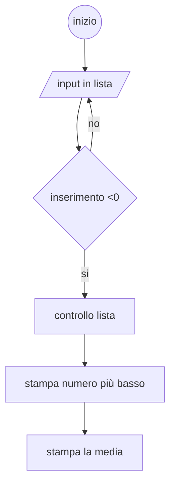

# INSERIMENTO DATI

## Obietivo
- calcola delle statistiche sulla base di alcuni punteggi inseriti dall'ultente 
- l'utente deve inseririre numeri interi
- l'inserimento di un numero negativo interrompe l'inserimento
- dopo l'interruzone il programma deve mostrare 
    - numero totale degli elementi inseriti
    - il più alto 
    - il più basso
    - la media

- se il primo numero inserito è negativo stampiamo un messaggio di errore
- usa una lista per memorizzare gli elementi inseriti dall'utente
- controlla come vengono gestiti gli input
- usa i metodi della libreria math

