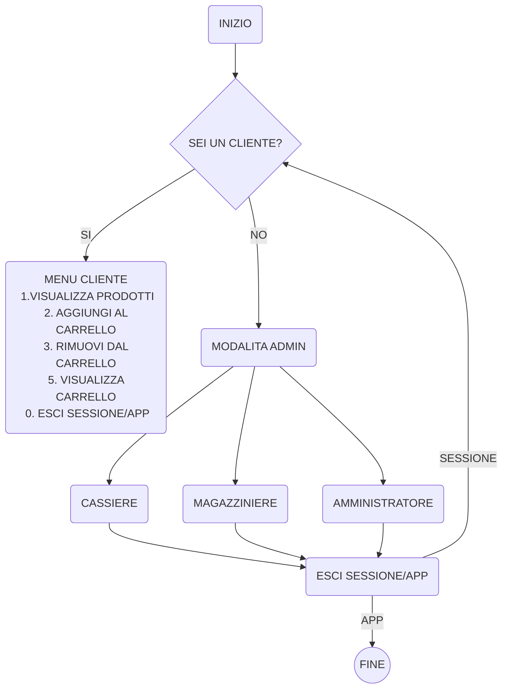
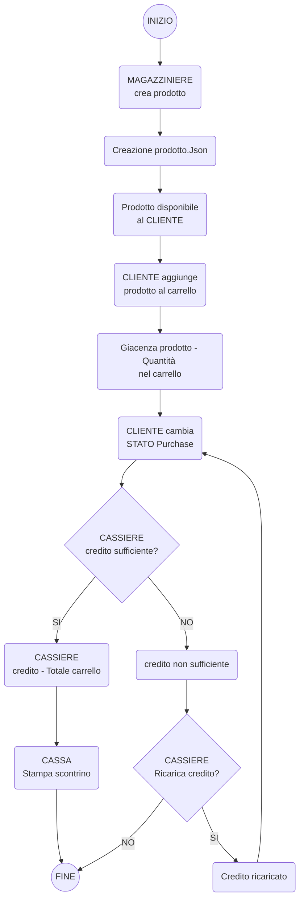

# SUPERMERCATO ADVANCED

Implementare le entita che compongono un supermercato.

---

|Dipendente|Tipo di dato|Note|
|---|---|---|
|ID|Int|viene generato in automatico con un progressivo|
|username|String|viene assegnato dall admin|
|ruolo|String|viene assegnato dall admin e puo essere cassiere o magazziniere|

|Cliente|Tipo di dato|Note|
|---|---|--|
|ID|int|viene generato in automatico con un progressivo|
|username|String|ognuno decide come vuole farlo|
|carrello|Prodotto[]||
|storico_acquisti|Purchases[]|viene popolato al termine di ogni acquisto|
|percentuale_sconto|int|viene incrementata a seconda del valore dello storico degli acquisti|
|credito|double|viene utilizzato per fare gli acquisti

|Prodotto|Tipo di dato|Note|
|---|---|---|
|ID|int|viene generato in automatico con un progressivo|
|nome|String|viene inserito dal magazziniere|
|prezzo|double|viene inserito dal magazziniere|
|giacenza|int|viene inserito dal magazziniere|
|categoria|string|viene inserito dal magaziniere|

|Categoria|Tipo di dato| Note|
|--|--|--|
ID|int|
Nome|string|

**Purchases è lo stato nel quale si trova l acquisto di un cliente. Prima di essere passato alla cassa**

* Quando viene passato allo stato `completato` la cassa puo processare lo scontrino.

|Purchases|Tipo di dato|Note|
|---|---|---|
|ID|int|viene generato in automatico con un progressivo|
|cliente|Cliente||
|prodotti|Prodotto[]|viene inserito dal cliente|
|quantita|int|viene inserita dal cliente|
|data|Date|viene generato in automatico con la data corrente (quando il cliente completa l acquisto)|
|stato|Bool|lo stato di un acquisto di default e `in corso` e puo essere modificato dal cliente in `completato` o `annullato` |

|Cassa|Tipo di dato|Note|
|---|---|---|
|ID|int|viene generato in automatico con un progressivo|
|dipendente|Dipendente|
|acquisti|Purchases[]|
|scontrino_processato|Bool|di default e `false` e diventa `true` quando la cassa ha processato lo scontrino|

**Ruoli (che sarebbe il menu):**

|Cassiere|Magazziniere|Amministratore|Cliente|
|---|---|---|---|
|puo registrare i prodotti acquistati da un cliente che ha degli acquisti in stato completato e calcolare il totale da pagare generando lo scontrino, e può ricaricare il credito del cliente quando è finito. |puo visualizzare aggiungere modificare o rimuovere prodotti dal magazzino e può gestire le categorie.|puo visualizzare ed impostare il ruolo dei dipendenti.|Può aggiungere o rimuovere prodotti e cambiare lo stato dell ordine|

---

# Primo commit: progettazione della navigazione



---

## Implementazioni:

* [x] Gestione generale del menu, passaggio da una modalità all'altra, gestione uscita dall'app
* [x] `CarrelloRepository` carica e salva correttamente sul file `json` (serialize, deserialize)
* [x] Logica di decremento giacenza e corretto aggiornamento dei repository di `Purchase.Json` e dei json in  `/catalogo`
* [x] Commenti completati su `CarrelloRepository.cs`
* [x] Commenti completati su `CarrelloAdvancedManager.cs > AggiungiProdotto`
* [x] Gestione del carello attraverso `CarrelloAdvancedManager` e `CarrelloRepository`
* [x] Visualizzazione del carrello (Qnt. - Nome - Prezzo)
* [x] Correzione bug 'condivisione giacenza tra carrello e catalogo'

## Obiettivi individuati (in aggiornamento):

in `CarrelloAdvancedManager.cs`

* [x] correggere `public void EliminaProdotto`

    - deve prendere come argomento `NomeProdotto`
    - deve riaggiungere la quantità alla giacenza
    ## Prossime implementazioni 

* Creare un oggetto `Cliente cliente` e associargli un carrello `cliente.Carrello` che rispecchia `Carrello.json`

* Acquisire lo `clente.Username`

> Commit

```bash
git add --all
git commit -m "Supermercato Avanzato 2/10 - prime implementazioni"
git push -u origin main
```

## Implementazioni:

in `class Cliente`

* [x] Creare un oggetto `Cliente cliente` e associargli un carrello `cliente.Carrello` che rispecchia `Carrello.json`

* [x] Acquisire lo `clente.Username`

* [x] Ottimizzazione della leggibilità del codice nel menu cliente + commenti completi 

## Obiettivi individuati (in aggiornamento):

Il file Purchase.json deve avere:
* [x] un `purchaseIdProgressivo` generato da una classe manager
* [x] una variabile `bool` di `stato`
* [x] ora e data del momento in cui `stato` passa da `false` a `true`, ovvero quando viene completato l'acquisto

Creare una classe `ClientiAdvancedManager`

* [x] calcola `clienteIdProgressivo`, 
* [x] tiene traccia e ricalcola `PercentualeDiSconto`
* [x] controllo dell'username
    - se username già nel database, carica dati di quel cliente
    - se non esiste, crearne uno nuovo. 

In `CarrelloAdvancedManager.cs` :
* [x] correggere `public void EliminaProdotto`

    - deve prendere come argomento `NomeProdotto`
    - deve riaggiungere la quantità alla giacenza
* [x] correggere `public void AggiornaProdotto`

    - deve prendere come argomento `NomeProdotto`

    - deve poter modificare la quantità
    - deve riaggiungere la quantità alla giacenza
    - in caso la nuova quantità sia zero deve eliminare la voce da `Purchase.json`

> Commit

```bash
git add --all
git commit -m "Supermercato Avanzato 2/10 - implementazione classe cliente"
git push -u origin main
```

# Grafico che rappresenta il diagramma del ciclo di vita del prodotto

Dall'inserimento nel magazzino al completamento dell'acquisto, con i ruoli dei dipendenti che effettuani queste operazioni 



## Implementazioni:

* [x] organizzazione file / cartelle
* [x] il file Purchase.json adesso salva Id e Stato
* [x] CarrelloRepository legge correttamente Purchase.json
* [x] implementazione `DipendentiRepository`
    - [x] SalvaDipendenti
    - [x] CaricaDipendenti
* [x] implementazione Menu `Amministratore`per operazioni CRUD su `Dipendenti`
    - [x] visualizza dipendenti
    - [x] aggiungi dipendenti
    - [x] elimina dipendenti
    - [x] modificare dipendenti
    - [x] Id automatico
* [x] implementazione Menu `Magaziniere` per operazioni CRUD su `Prodotti`
    - [x] aggiunge
    - [x] visualizza
    - [x] trova per id
    - [x] aggiorna
    - [x] elimina
    - [x] esce

> Commit

```bash
git add --all
git commit -m "Supermercato Advanced - 2/10 completamento in corso"
git push -u origin main
```

---

#### IMPLEMENTAZIONI

> NOTA: Disattivato temporaneamente la funzione Purchase

* [x] `AggiungiProdotto` in `CarrelloAdvancedManager` ora aggiunge i prodotti nel carrello salvato nel file Json del cliente.
* [x] Nuovo modello: `ProdottoCarrello`. Per risolvere un bug di trasferimento dal magazzino al carrello (dove nel carrello veniva trasferita la giacenza piuttosto che la quantità inserita dall'utente) è stato creato un nuovo modello che rappresenta il prodotto nel carrello. Rispecchia il modello del prodotto nel magazzino tranne per il campo Giacenza che in ProdottoCarrello si chiama `Quantita`.
* [x] Creata classe `ClientiManager.cs` per la gestione dei clienti. Esegue principalmente il controllo dell'username: se username già nel database, carica dati di quel cliente, se non esiste, crearne uno nuovo.
* [x] Creata Classe `ClientiRepository`, i quali metodi vengono richiamati per salvare in runtime le modifiche fatte nel carrello nel file json dello specifico cliente. 
* [x] Aggiornata classe `StampaTabella`, nello specifico il metodo `Carrello` per visualizzazione del carrello con i nuovi campi della classe ProdottoCarrello.

> In corso: RIMOZIONE DAL CARRELLO

```bash
git add --all
git commit -m "Supermercato Avanzato 2/10 - rimozione dal carrello non funzionante"
git push -u origin main
```

# Documentazione versione corrente (sviluppo in corso)

> Dipendenze:

```
dotnet add package Newtonsoft.Json
```

# Modelli

## Prodotto

```c#
public class Prodotto
{

    public int Id { get; set; }
    public string Nome { get; set; }
    public decimal Prezzo { get; set; }
    public int Giacenza {get; set; }
    public Categoria Categoria { get; set; }

}

```
Il modello descrive il prodotto quando ancora in magazzino. Questo modello viene creato e gestito dal `Dipendente` con ruolo 'Magazziniere' nel suo MENU dedicato. `Id` viene generato automaticamente.

|Tipo di pesistenza:|Json|
|--|--|
|Percorso:|data/catalogo|

#### ProdottoCarrello

```c#
public class ProdottoCarrello
{
    public int Id { get; set; }
    public string Nome { get; set; }
    public decimal Prezzo { get; set; }
    public int Quantita {get; set; }
    public Categoria Categoria { get; set; }
}
```

Il modello descrive il prodotto quando viene spostato nel carrello. Differisce dal modello `Prodotto` solo per l'attributo `Giacenza` , che qui diventa `Quantita` . E' stata creata questa distinzione per evitare errori di riferimento.

|Tipo di pesistenza:|Json|
|--|--|
|Percorso:|data/clienti|

## Categoria

```c#
public class Categoria()
{

    public string Name;	
    public int ID;

}

```
Il modello descrive la classe `Categoria` che viene usata come attributo di entrambi i modelli `Prodotti`. Attualmente vi sono 3 Categorie predefinite ma nelle prossime implementazioni potranno essere create e gestite nuove categorie dal MENU del Magazziniere.

|Tipo di pesistenza:| Ancora non gestita|
|--|--|
|Percorso:|Ancora non gestita|

## Cliente

```c#
public class Cliente
{
    public int Id { get; set;}
    public string Username { get; set;}
    public List<ProdottoCarrello> Carrello { get; set;}
    public List<ProdottoCarrello> StoricoAcquisti { get; set;}
    public int PercentualeSconto { get; set;}
    public decimal Credito { get; set;}
}
```

Il modello descrive ogni entità `Cliente` che fa accesso all'applicazione per acquistare un prodotto. 

Oltre ai dati semplici (int `Id` , string `Username` , int `PercentualeSconto` , decimal `Credito` ) possiede due strutture di dato complesse che gli permettono di immagazzinare gli acquisti, sia in corso ( `Carrello` ), che passati ( `StoricoAcquisti` ).

All'avvio dell'applicazione, viene richiesto l' `Username` : il programma ricerca se lo Username è già presente tra i file .json in `data/clienti` . 

Se presente, carica i dati riguardanti quel cliente e li mette a disposizione in RunTime, altrimenti crea un nuovo .json col il nuovo Username. 
|Tipo di pesistenza:|Json|
|--|--|
|Percorso:|data/clienti|

## Dipendente

```c#
public class Dipendente
{

    public string Ruolo {   get; set; }
    public string Username { get; set; }
    public int Id { get; set; }

}

```
Questo modello descrive la classe Dipendente, attraverso il quale sarà possibile discriminare quali operazioni saranno disponibili a seconda dell'attributo `Ruolo`.

Ogni istanza Dipendente viene attualmente creata attraverso il MENU dell'Amministratore. Attualmente attraverso il menù è possibile eseguire tutte le operazioni CRUD.
|Tipo di pesistenza:|Json|
|--|--|
|Percorso:|data/dipendenti|

---
# Repositories

## ClientiRepository

```c#
public class ClientiRepository
```

|Percorso di salvataggio:|data/clienti|
|--|--|

### Contiene i metodi:

```c#
public List<Cliente> CaricaClienti()

```
Restituisce un dato di tipo `List<Cliente>` in seguito ad una lettura dei file nel percorso. Questo metodo è necessario per poter comparare lo `Username` richiesto all'avvio con quelli già presenti in archivio.
```c#
public void SalvaClienti(Cliente cliente)
```

Aggiorna o Salva un nuovo cliente nel percorso.

> DA REVISIONARE / SEMPLIFICARE LA LOGICA:

```c#
public Cliente CaricaCliente(Cliente cliente) 
//INCERTO SULL'USO DI QUESTO METODO

```
Restituisce un singolo cliente. 

> Codice completo:

<details>

```c#
using System.Data.Common;
using Newtonsoft.Json;

public class ClientiRepository
{
    private readonly string filePath = "clienti.json"; 
    private readonly string dirCatalogo = "data/clienti"; 

    public void SalvaClienti(Cliente cliente)
    {
        string nuovoPercorso = "";
        if (!Directory.Exists(dirCatalogo)) // se non esiste la cartella
        {
            Directory.CreateDirectory(dirCatalogo); // creala
        }
        string jsonData = JsonConvert.SerializeObject(cliente, Formatting.Indented); // serializza il prodotto
        string nomeProdotto = $"{cliente.Id}.json"; // creo il nome del file 
        nuovoPercorso = Path.Combine(dirCatalogo, nomeProdotto); // creo il percorso
        File.WriteAllText(nuovoPercorso, jsonData); // scrivo il prodotto deserializzato nel percorso
        //Console.WriteLine($"Dati salvati in '{nuovoPercorso}'\n"); // stampo il percorso 
    }

    public List<Cliente> CaricaClienti()
    {
        if (Directory.Exists(dirCatalogo))
        {
            string[] files = Directory.GetFiles(dirCatalogo);  // carico il contenuto della cartella in una lista di stringhe

            if (files.Length > 0) // controllo che ci siano file nella cartella, se ci sono file
            {
                List<Cliente> listaClientiLocale = new List<Cliente>(); // crea una lista locale
                Cliente letturaCliente; // crea un'istanza temporanea del prodotto
                foreach (string file in files) // per ogni file dentro la cartella
                {
                    string readJsonData = File.ReadAllText(file);  // leggi il file
                    letturaCliente = JsonConvert.DeserializeObject<Cliente>(readJsonData)!; // deserializzo dentro l'istanza temporanea
                    listaClientiLocale.Add(letturaCliente); // aggiungo l'istanza temporanea alla lista locale
                }
                return listaClientiLocale; // restituisco la lista locale
            }
            else
            {
                return new List<Cliente>(); // se la cartella esiste ma non ci sono file restituisci una lista vuota 
            }
        }
        else // se non esiste la cartella creala e restiuisci una lista vuota
        {
            Directory.CreateDirectory(dirCatalogo);
            return new List<Cliente>();
        }
    }

    public Cliente CaricaCliente(Cliente cliente)
    {
        List<Cliente> clientiLocale = CaricaClienti();

        foreach (var user in clientiLocale)
        {
            if (user.Username == cliente.Username)
            {
                return user;
            }
        }
        return null;
    }
}
```

</details>

> NOTE AGGIUNTIVE: Ridondanza nel codice. Pare che `filePath = "clienti.json";` non venga mai utilizzata perché il percorso del file successivamente sarà `data/clienti/{id del cliente}.json` . Semplificare.

---

## DipendentiRepository

|Percorso di salvataggio| data/dipendenti|
|--|--|
```c#
public class DipendentiRepository

```

### Contiene i metodi:

```c#
public void SalvaDipendenti(List<Dipendente> dipendenti)
```

Salva la lista dei dipendenti su .json

```c#
public List<Dipendente> CaricaDipendenti()

```
Legge i file nella cartella dipendenti e li deserializza in una variabile `List<Dipendente>`.

> Codice completo:

<details>

```c#
using System.Data.Common;
using Newtonsoft.Json;

public class DipendentiRepository
{
    private readonly string filePath = "dipendenti.json"; // percorso in cui memorizzare i dati
    private readonly string dirCatalogo = "data/dipendenti"; //

    //metodo per salvare i dati su file 
    public void SalvaDipendenti(List<Dipendente> dipendenti)
    {
        string nuovoPercorso = ""; // creo una variabile per ospitare il nuovo percorso
        if (!Directory.Exists(dirCatalogo)) // se non esiste la cartella
        {
            Directory.CreateDirectory(dirCatalogo); // creala
        }

        foreach (var dipendente in dipendenti) // per ogni prodotto nella lista argomento
        {
            string jsonData = JsonConvert.SerializeObject(dipendente, Formatting.Indented); // serializza il prodotto
            string nomeProdotto = $"{dipendente.Id}.json"; // creo il nome del file 
            nuovoPercorso = Path.Combine(dirCatalogo,nomeProdotto); // creo il percorso
            File.WriteAllText(nuovoPercorso, jsonData); // scrivo il prodotto deserializzato nel percorso
        }
        Console.WriteLine($"Dati salvati in '{nuovoPercorso}'\n"); // stampo il percorso 
    }

    public List<Dipendente> CaricaDipendenti()
    {
        // // string nuovoPercorso = Path.Combine(dirCatalogo, prodo)
        if (Directory.Exists(dirCatalogo))
        {
            string[] files = Directory.GetFiles(dirCatalogo);  // carico il contenuto della cartella in una lista di stringhe
            
            if (files.Length > 0) // controllo che ci siano file nella cartella, se ci sono file
            {
                List<Dipendente> listaDipendentiLocale = new List<Dipendente>(); // crea una lista locale
                Dipendente letturaDipendente; // crea un'istanza temporanea del prodotto
                foreach(string file in files) // per ogni file dentro la cartella
                {
                    string readJsonData = File.ReadAllText(file);  // leggi il file
                    letturaDipendente = JsonConvert.DeserializeObject<Dipendente>(readJsonData)!; // deserializzo dentro l'istanza temporanea
                    listaDipendentiLocale.Add(letturaDipendente); // aggiungo l'istanza temporanea alla lista locale
                }
                return listaDipendentiLocale; // restituisco la lista locale
            }
            else
            {
                return new List<Dipendente>(); // se la cartella esiste ma non ci sono file restituisci una lista vuota 
            }
        }
        else // se non esiste la cartella creala e restiuisci una lista vuota
        {
            Directory.CreateDirectory(dirCatalogo); 
            return new List<Dipendente>(); 
        }
    }
}
```

</details>

> NOTE AGGIUNTIVE: Ridondanza nel codice. Pare che `filePath = "dipendenti.json";` non venga mai utilizzata perché il percorso del file successivamente sarà `data/dipendenti/{id del dipendente}.json` . Semplificare.

----

## ProdottoRepository

|Percorso di salvataggio| data/catalogo|
|--|--|

```c#
public class ProdottoRepository

```

### Contiene i metodi:

```c#
public void SalvaProdotti(List<Prodotto> prodotti)
```

Salva il dato di tipo List<Prodotto> in singoli .json.

```c#
public List<Prodotto> CaricaProdotti()

```
Legge i file .json di data/catalogo e restituisce una List<Prodotto>.

> Codice completo:

<details>

```c#
using System.Data.Common;
using Newtonsoft.Json;

public class ProdottoRepository
{
    private readonly string filePath = "prodotti.json"; // percorso in cui memorizzare i dati
    private readonly string dirCatalogo = "data/catalogo"; //

    //metodo per salvare i dati su file 
    public void SalvaProdotti(List<Prodotto> prodotti)
    {
        string nuovoPercorso = ""; // creo una variabile per ospitare il nuovo percorso
        if (!Directory.Exists(dirCatalogo)) // se non esiste la cartella
        {
            Directory.CreateDirectory(dirCatalogo); // creala
        }

        foreach (var prodotto in prodotti) // per ogni prodotto nella lista argomento
        {
            string jsonData = JsonConvert.SerializeObject(prodotto, Formatting.Indented); // serializza il prodotto
            string nomeProdotto = $"{prodotto.Id}.json"; // creo il nome del file 
            nuovoPercorso = Path.Combine(dirCatalogo,nomeProdotto); // creo il percorso
            File.WriteAllText(nuovoPercorso, jsonData); // scrivo il prodotto deserializzato nel percorso
        }
        // Console.WriteLine($"Dati salvati nella cartella '/{dirCatalogo}'\n"); // stampo il percorso 
    }

    public List<Prodotto> CaricaProdotti()
    {
        // string nuovoPercorso = Path.Combine(dirCatalogo, prodo)
        if (Directory.Exists(dirCatalogo))
        {
            string[] files = Directory.GetFiles(dirCatalogo);  // carico il contenuto della cartella in una lista di stringhe
            
            if (files.Length > 0) // controllo che ci siano file nella cartella, se ci sono file
            {
                List<Prodotto> catalogoLocale = new List<Prodotto>(); // crea una lista locale
                Prodotto prodottoLocale; // crea un'istanza temporanea del prodotto
                foreach(string file in files) // per ogni file dentro la cartella
                {
                    string readJsonData = File.ReadAllText(file);  // leggi il file
                    prodottoLocale = JsonConvert.DeserializeObject<Prodotto>(readJsonData)!; // deserializzo dentro l'istanza temporanea
                    catalogoLocale.Add(prodottoLocale); // aggiungo l'istanza temporanea alla lista locale
                }
                return catalogoLocale; // restituisco la lista locale
            }
            else
            {
                return new List<Prodotto>(); // se la cartella esiste ma non ci sono file restituisci una lista vuota 
            }
        }
        else // se non esiste la cartella creala e restiuisci una lista vuota
        {
            Directory.CreateDirectory(dirCatalogo); 
            return new List<Prodotto>(); 
        }
    }
}
```

</details>

---

# Managers

## ProdottoAdvancedManager

Gestisce le operazioni CRUD su `List<Prodotto> prodotti` . 

**Il metodo è accessibile solo attraverso il MENU del Magazziniere.**

### Il metodo contiene:

```c#
public void AggiungiProdotto (Prodotto prodotto)

```
```c#
public List<Prodotto> OttieniProdotti()
```

```c#
public Prodotto TrovaProdotto(int id)

```
```c#
public void AggiornaProdotto(int id, Prodotto nuovoProdotto)
```

```c#
public void EliminaProdotto (int id)

```

> Codice completo:

<details>

```c#
using System.Runtime.CompilerServices;
using Newtonsoft.Json;

public class ProdottoAdvancedManager
{  
    private List<Prodotto> prodotti; // prodotti e' private perche non voglio che venga modificato dall'esterno
    private readonly string filePath = "prodotti.json"; // percorso in cui memorizzare i dati
    private readonly string dirCatalogo = "data/catalogo";
    // private ProdottoRepository repo;
    private int prossimoId;
    public ProdottoAdvancedManager(List<Prodotto> Prodotti)
    {
        prodotti = Prodotti;
        // repo = new ProdottoRepository(); //! non la sto usando ma è buono sapere che il costruttore inizializzi le variabili dichiarate nel campo della classe

        prossimoId = 1;
        foreach (var prodotto in prodotti)
        {
            if (prodotto.Id >= prossimoId)
            {
                prossimoId = prodotto.Id + 1;
            }
        }

        //this.prodotti = prodotti; //? "collego" la variabile prodotti passata come argomento alla variabile privata

        // inizializzo la lista di prodotti nel costruttore pubblico in modo che sia accessibile all'esterno
        // questo new è necessario affinchè dal dominio privato la classe possa comunicare all'esterno i dati aggiornati/manipolati
        // un modo per rendere pubblico un dato privato
    }

    // metodo per aggiungere
    public void AggiungiProdotto (Prodotto prodotto)
    {
        prodotto.Id = prossimoId;
        prossimoId++;
        prodotti.Add(prodotto); // quella private
    }

    // metodo per visualizzare 
    public List<Prodotto> OttieniProdotti()
    {
        return prodotti;
    }

    // metodo per cercare un prodotto 
    public Prodotto TrovaProdotto(int id)
    {
        foreach (var prodotto in prodotti)
        {
            if (prodotto.Id == id)
            {
                return prodotto;
            }
        }
        return null;
    }

    // metodo per modificare il prodotto
    public void AggiornaProdotto(int id, Prodotto nuovoProdotto)
    {
        var prodotto = TrovaProdotto (id);
        if (prodotto != null)
        {
            prodotto.Nome = nuovoProdotto.Nome;
            prodotto.Prezzo = nuovoProdotto.Prezzo;
            prodotto.Giacenza = nuovoProdotto.Giacenza;
        }
    }

    // metodo per eliminare un prodotto
    public void EliminaProdotto (int id)
    {
        var prodotto = TrovaProdotto(id); // salvo il prodotto nella variabile se lo trovo, se non lo trova prodotto = null
        if (prodotto != null) // se lo trova
        {
            string[] files = Directory.GetFiles(dirCatalogo); // salvo l'elenco di file nella cartella 
            foreach (string file in files) // per ogni file nella cartella 
            {
                string readJsonData = File.ReadAllText (file); // leggo il contenuto del file 
                Prodotto prodottoTemporaneo = JsonConvert.DeserializeObject<Prodotto>(readJsonData)!; // lo deserializzo in un prodotto temporaneo
                if (prodottoTemporaneo.Id == id) // se l'id del prodotto temporaneo è uguale all'id inserito dall'utente
                {
                    File.Delete(file); // elimina il file 
                    // repo.SalvaProdotti(prodotti);
                }
            }
            prodotti.Remove(prodotto); // rimuovi il prodotto dalla lista runtime
        }
    }
}
```

</details>

---

## DipendentiManager

Attraverso questa classe è possibile eseguire le operazioni CRUD sui dipendenti. E' accessibile dal MENU Amministratore.

### Contiene i metodi

```c#
public DipendentiManager(List<Dipendente> Dipendenti)

```
```c#
public Dipendente CreaDipendente()
```

```c#
public int AssegnaId(List<Dipendente> elencoDipendenti)

```
```c#
public void EliminaDipendente(int Id)
```

```c#
public void EliminaDipendente(int Id)

```
```c#
public Dipendente TrovaDipendentePerId(int Id)
```

```c#
public void AggiornaDipendente(int Id)

```
> Codice completo:

<details>

```c#
using Newtonsoft.Json;

public class DipendentiManager
{
    private readonly string dirDipendenti = "data/dipendenti";
    public List<Dipendente> dipendenti;
    public DipendentiRepository repositoryDipendenti;

    public DipendentiManager(List<Dipendente> Dipendenti)
    {
        dipendenti = Dipendenti;
        repositoryDipendenti = new DipendentiRepository();
    }
    public Dipendente CreaDipendente()
    {
        Dipendente nuovoDipendente = new Dipendente();
        DipendentiRepository repoDipendenti = new DipendentiRepository();

        nuovoDipendente.Username = InputManager.LeggiStringa("Username del nuovo dipendente: ");
        nuovoDipendente.Ruolo = InputManager.LeggiStringa("Ruolo: ");
        nuovoDipendente.Id = AssegnaId(dipendenti);
        Console.WriteLine($"Nuovo dipendente creato! Username:{nuovoDipendente.Username}, Ruolo: {nuovoDipendente.Ruolo}, ID: {nuovoDipendente.Id}");
        return nuovoDipendente;
    }

    public int AssegnaId(List<Dipendente> elencoDipendenti)
    {
        int prossimoId = 1;
        foreach (var dipendente in elencoDipendenti)
        {
            if (dipendente.Id >= prossimoId)
            {
                prossimoId = dipendente.Id + 1;
            }
        }
        return prossimoId;
    }

    public void EliminaDipendente(int Id)
    {
        Dipendente dipendenteDaEliminare = TrovaDipendentePerId(Id);
        if (dipendenteDaEliminare != null)
        {
            string[] files = Directory.GetFiles(dirDipendenti); // salvo l'elenco di file nella cartella 
            foreach (string file in files) // per ogni file nella cartella 
            {
                string readJsonData = File.ReadAllText(file); // leggo il contenuto del file 
                Dipendente dipendente = JsonConvert.DeserializeObject<Dipendente>(readJsonData)!; // lo deserializzo in un prodotto temporaneo
                if (dipendente.Id == Id) // se l'id del prodotto temporaneo è uguale all'id inserito dall'utente
                {
                    File.Delete(file); // elimina il file 
                                       // repo.SalvaProdotti(prodotti);
                }
            }
            dipendenti.Remove(dipendenteDaEliminare); ; // rimuovi il prodotto dalla lista runtime
        }
    }

    public Dipendente TrovaDipendentePerId(int Id)
    {
        bool trovato = false;
        foreach (var dipendente in dipendenti)
        {
            if (dipendente.Id == Id)
            {
                trovato = true;
                return dipendente;
            }
        }
        if (!trovato)
        {
            Console.WriteLine("Cliente non trovato;");
            return null;
        }
        return null;
    }

    public void AggiornaDipendente(int Id)
    {
        Dipendente dipendente = TrovaDipendentePerId(Id);
        if(dipendente == null)
        {
            Console.WriteLine("Dipendente non trovato.");
        }
        else
        {
            dipendente.Username = InputManager.LeggiStringa("Username > ");
            dipendente.Ruolo = InputManager.LeggiStringa("Ruolo > ");
            repositoryDipendenti.SalvaDipendenti(dipendenti);
        }

    }
}
```

</details>

## ClientiManager

**NOTA: Attualmente questa classe viene utilizzata solo dal programma e non viene 
gestita direttamente da nessuna entità.**

### Contiene i metodi

```c#
public List<Cliente> OttieniClienti()

```

```c#
public ClientiManager(List<Cliente> Clienti)
```

```c#
public Cliente CreaCliente()

```

```c#
public Cliente CheckCliente(string username)
```

```c#
public int AssegnaId(List<Cliente> elencoClient)

```

```c#
public void EliminaCliente(int Id)
```

```c#
public Cliente TrovaClientePerId(int Id)

```

```c#
public void AggiornaCliente(int Id)
```

> Codice completo:

<details>

```c#
using System. Runtime. CompilerServices; 
using Newtonsoft. Json; 

public class ClientiManager
{

    private readonly string dirClienti = "data/clienti";
    public List<Cliente> clienti;
    public ClientiRepository repositoryClienti;
    public Cliente nuovoCliente; 
    //public ClientiRepository repoClienti = new ClientiRepository();

    public List<Cliente> OttieniClienti()
    {
        return clienti;
    } 

    public ClientiManager(List<Cliente> Clienti)
    {
        clienti = Clienti; 
        repositoryClienti = new ClientiRepository(); 
        nuovoCliente = new Cliente(); 

    }

    public Cliente CreaCliente()
    {
        string username = InputManager. LeggiStringa("Inserisci il tuo Username > "); 

        nuovoCliente = CheckCliente(username);

        if (nuovoCliente != null)
        {
            return nuovoCliente; 
        }
        else
        {
            Console. WriteLine($"Benvenuto per la priva volta {username}! Un nuovo account è stato creato, buona spesa!"); 
            nuovoCliente = new Cliente {Username = username, Id = AssegnaId(clienti), Carrello = new List <ProdottoCarrello>(), StoricoAcquisti = new List <ProdottoCarrello>(), PercentualeSconto = 0, Credito = 200m }; 
            clienti. Add(nuovoCliente); 
            repositoryClienti. SalvaClienti(nuovoCliente); 
            return nuovoCliente; 
        }

        return null;

    }

    public Cliente CheckCliente(string username)
    {
        if (Directory.Exists(dirClienti))
        {
            string[] files = Directory.GetFiles(dirClienti); // salvo l'elenco di file nella cartella 
            foreach (string file in files) // per ogni file nella cartella 
            {
                string readJsonData = File.ReadAllText(file); // leggo il contenuto del file 
                Cliente cliente = JsonConvert.DeserializeObject<Cliente>(readJsonData)!; // lo deserializzo in un prodotto temporaneo
                if (cliente.Username == username) // se l'id del prodotto temporaneo è uguale all'id inserito dall'utente
                {
                    return cliente;
                }
            }
        }
        else
        {
            Directory.CreateDirectory(dirClienti);
        }

        return null;

    }

    public int AssegnaId(List<Cliente> elencoClienti)
    {
        int prossimoId = 1; 
        foreach (var cliente in elencoClienti)
        {
            if (cliente. Id >= prossimoId)
            {
                prossimoId = cliente. Id + 1; 
            }
        }
        return prossimoId; 

    }

    public void EliminaCliente(int Id)
    {
        Cliente dipendenteDaEliminare = TrovaClientePerId(Id); 
        if (dipendenteDaEliminare != null)
        {
            string[] files = Directory. GetFiles(dirClienti); // salvo l'elenco di file nella cartella 
            foreach (string file in files) // per ogni file nella cartella 
            {
                string readJsonData = File. ReadAllText(file); // leggo il contenuto del file 
                Cliente cliente = JsonConvert. DeserializeObject<Cliente>(readJsonData)!; // lo deserializzo in un prodotto temporaneo
                if (cliente. Id == Id) // se l'id del prodotto temporaneo è uguale all'id inserito dall'utente
                {
                    File. Delete(file); // elimina il file 
                                       // repo. SalvaProdotti(prodotti); 
                }
            }
            clienti. Remove(dipendenteDaEliminare); ; // rimuovi il prodotto dalla lista runtime
        }

    }

    public Cliente TrovaClientePerId(int Id)
    {
        bool trovato = false; 
        foreach (var cliente in clienti)
        {
            if (cliente. Id == Id)
            {
                trovato = true; 
                return cliente; 
            }
        }
        if (!trovato)
        {
            Console. WriteLine("Cliente non trovato; "); 
            return null; 
        }

        return null;

    }

    public void AggiornaCliente(int Id)
    {
        Cliente cliente = TrovaClientePerId(Id);
        if (cliente == null)
        {
            Console.WriteLine("Cliente non trovato.");
        }
        else
        {
            cliente.Username = InputManager.LeggiStringa("Username > ");
            // cliente.Ruolo = InputManager.LeggiStringa("Ruolo > ");
            repositoryClienti.SalvaClienti(cliente);
        }

    }

}

```
</details>

> Versionamento

```bash
git add --all
git commit -m "Supermercato Advanced 2/10 - Documentazione versione in corso"
git push -u origin main
```

--- 

> Nota: errore durante il comando `git pull` . Aggiornato il repository con un comando d'emergenza.

> Versionamento d'emergenza

```bash
git add --all
git commit -m "Supermercato Advanced 3/10 - Correzione Commit"
git push -u origin main
```

---

#### IMPLEMENTAZIONI

* [x] Gestione permessi per l'accesso ai differenti terminali dei dipendenti
* [x] Creazione di un account admin che permette l'accesso completo a tutti i terminali
* [x] Correzione bug nell'aggiunta al carrello di un prodotto e di una sua restituzione
> NOTA: esclusa temporaneamente la possibilità di "modifica". In caso l'utente voglia cambiare la quantità acquistata dovrà rimuovere l'articolo dal carrello e reinserirlo con la quantità desiderata. Implementazioni future per questa funzionalità.
* [x] CRUD delle categorie da parte del magazziniere, che ora può creare, modificare, eliminare categorie. Inoltre durante la creazione di un nuovo Prodotto è possibile scegliere la categoria da una lista aggiornata.
    - [x] Creazione CategorieRepository
    - [x] Creazione CategorieManager
    - NOTA: le categorie vengono salvate su file json come array/lista di oggetti di classe Categoria.
* [x] Miglioramento del layout complessivo, per spazi, e comprensibilità di navigazione sui terminali dei dipendenti.

```bash
git add --all
git commit -m "Supermercato Advanced 5/10 - Voci presenti nel menu correttamente funzionanti"
git push -u origin main
```

---

#### IMPLEMENTAZIONI

* [x] Gestione, creazione e salvataggio dei `Purchais` e fabbricazione dello scontrino
* [x] Visibilità dell'acquisto in stato "True" su un'interfaccia accessibile dal menu `Cassiere`
* [x] calcolo `Totale`
* [x] gestione permessi e creazione di account admin che accede a tutti i menu

> Problematiche nel completamento dell'acquisto da parte del cassiere. 

```bash
git add --all
git commit -m "Supermercato Advanced 6/10 - Inizio implementazione cassiere"
git push -u origin main
```

* [X] decremento credito: fatto
-[ ] manca salvare nel json del cliente lo storico acquisti
* [ ] calcolare percentuale sconto
-[ ] semplificare il codice

```c#
//todo: var aggiornaCliente = item. PurchaseCliente; 
//todo: aggiornaCliente. Carrello. Clear(); 
//todo: aggiornaCliente. StoricoAcquisti. Add(new Purchase = item); 
//todo: repositoryClienti. SalvaClienti(aggiornaCliente); 

```
```bash
git add --all
git commit -m "Supermercato Advanced 7/10 - Completamento purchase"
git push -u origin main
```

#### NEXT TODO:

* [x] salvataggio carrello in `cliente.StoricoAcquisti`

> NOTA: Ho individuato un problema di ricorsività attribuibile ad un errore di progettazione: la classe `Cliente` continiene una lista `Purchases[]` , e la classe `Purchases` contiene al suo interno l'attributo `Cliente` . In seguito alle simulazioni di diversi acquisti ho constatato una ricorsività, se così si può chiamare, o meglio una ridondanza che all'auemtare del numero di acquisti rende più complesso il reperimento dei dati perché incapsulati in strutture sempre più complesse. 

> `IPOTIZZO` : sia necessario una semplificazione delle specifiche affinché i dati siano tanto leggibili dal file json quanto accessibili attraverso le future implementazioni che richiederanno il richiamo dei dati contenuti in esso.

```bash
git add --all
git commit -m "Supermercato Advanced - 8/10 - Necessaria riprogettazione delle specifiche"
git push -u origin main
```

---

* [x] Riprogettazione delle specifiche eseguita

** BUG: **
In seguito al completamento dell'acquisto da parte del cassiere la variabile `Completed` del purchase diventa `true` come da aspettativa. Tuttavia, in caso di un secondo acquisto, il purchase precedente torna ad avere lo stato `Completed` a `false` , rendendolo di nuovo visualizzabile dal cassiere nella lista di acquisti da processare. 

> `IPOTIZZO` che ciò abbia a che fare con la gestione del `PurchaseManager` e la sua gestione interna della variabile privata. ** DA CORREGGERE **.

```bash
git add --all
git commit -m "Supermercato Advanced - 8.5/10 - Necessaria riprogettazione delle specifiche"
git push -u origin main
```

---

* [x] Correzione BUG purchase precedente

```bash
git add --all
git commit -m "Supermercato Advanced - 9/10 - Ultime implementazioni"
git push -u origin main
```

#### IMPLEMENTAZIONI:

* [x] Possibilità dell'amministratore di verificare il guadagno totale.
* [x] Possibilità del cassiere di ricaricare `cliente.Credito` in caso di credito non sufficiente.

```bash
git add --all
git commit -m "Supermercato Advanced - 9.5/10 - Funzionante"
git push -u origin main
```

#### IMPLEMENTAZIONI:

* [x] ottimizzazione dei modelli

```bash
git add --all
git commit -m "Supermercato Advanced - 9.6/10 - ottimizzazione dei modelli"
git push -u origin main
```

#### IMPLEMENTAZIONI:

* [x] calcolo sconto per clienti fedeli

```bash
git add --all
git commit -m "Supermercato Advanced - 9.9/10 - completamente funzionante, ora in fase di design"
git push -u origin main
```

#### IMPLEMENTAZIONI:

* [x] Design omogeneo e colori per differenziare le diverse operazioni e menu
* [x] Ricarica da parte del cassiere funzionante 

# VERSIONE STABILE
### LA PRESENTE VERSIONE (10.10) E' LA PIU' SOLIDA NELLA SUA INTEREZZA 
#### PROSSIME IMPLEMENTAZIONI EXTRA

```bash
git add --all
git commit -m "Supermercato Advanced - 10/10 - VERSIONE STABILE"
git push -u origin main
```
# VERSIONE STABILE v11
### RISOLTA PROBLEMATICA NELLA PROCESSAZIONE MULTIPLA DEI PURCHASES

* [x] Cliente può visualizzare prodotti per categoria

```bash
git add --all
git commit -m "Supermercato Advanced - v11 (SOLIDA)"
git push -u origin main
```
* [x] Cliente deve poter visualizzare il proprio `storico`

```bash
git add --all
git commit -m "Supermercato Advanced - v11.1 (Cliente visualizza lo storico)"
git push -u origin main
```

* [x] Amministratore deve calcolare il fatturato solo dei purchase già processati

```bash
git add --all
git commit -m "Supermercato Advanced - v11.2 (Totale fatturato solo dei purchase completati dal cassiere)"
git push -u origin main
```

* [x] I `Ruoli` devono essere quindi predefiniti e selezionabili per evitare errori di battitura

```bash
git add --all
git commit -m "Supermercato Advanced - v11.3 (Ruoli predefiniti selezionabili)"
git push -u origin main
```

* [x] Isolare la stampa di `BENTORNATO {cliente.Username}` dal metodo `GeneraCliente` e spostarlo nel `Program.cs`

```bash
git add --all
git commit -m "Supermercato Advanced - v11.4 (Spostata la stampa BENVENUTO / BENTORNATO dalla classe al Program.cs)"
git push -u origin main
```

* [x] Amministratore deve visualizzare la lista dei `clienti` e le loro complete informazioni

```bash
git add --all
git commit -m "Supermercato Advanced - v11.5 (Amministratore visualizza dai dei clienti e informazioni)"
git push -u origin main
```
* [x] Il cassiere deve poter visualizzare i clienti, e scegliere ID del cliente da ricaricare

```bash
git add --all
git commit -m "Supermercato Advanced - v11.6 (Il cassiere può scegliere il cliente da ricaricare tramite ID)"
git push -u origin main
```

* [x] Amministratore può Visualizzare, Creare ed Eliminare le casse

```bash
git add --all
git commit -m "Supermercato Advanced - v11.7 (CRUD Casse via Amministratore)"
git push -u origin main
```

* [x] Generazione di uno scontrino .txt generato da una nuova classe `Cassa`

```bash
git add --all
git commit -m "Supermercato Advanced - v11.8 (Cassa e scontrino .txt)"
git push -u origin main
```

* [x] La cassa memorizza correttamente gli storici degli acquisti
* [x] spostata la generazione degli scontrini nel manager delle casse
* [x] formattazione scontrini
* [x] risoluzione bug di visualizzazioni superflue

```bash
git add --all
git commit -m "Supermercato Advanced - v11.9 (formattazione scontrini, correzione bug storico acquisti cassa)"
git push -u origin main
```

* [x] Revisione delle rimanenti ridondanze nelle classi e nel Program.cs
* [x] Commentare meglio il codice e renderlo eventualmente più leggibile

```bash
git add --all
git commit -m "Supermercato Advanced - v12 (documentazione Program.cs)"
git push -u origin main
```
* [x] Scrivere note finali

# NOTE FINALI: 

## Considerazioni
Ho trovato necessario rivedere la definizioni di alcuni modelli affinché non si verificassero delle problematiche ricorsività e oggetti annidati, discostandomi dalla loro progettazione di partenza. Ciò è stato fatto per avere il comportamento logico che ci si aspettava, adattandoli ai miei casi ma cercando di mantenerne la logica concettuale.

Nello specifico:

## CLIENTE PROGETATTO (PRIMA)

|Cliente|Tipo di dato|
|---|---|
|ID|int|
|username|String|
|carrello|Prodotto[]||
|storico_acquisti|Purchases[]|
|percentuale_sconto|int|
|credito|double|

## PURCHASES PROGETTATO (PRIMA)
|Purchases|Tipo di dato|
|---|---
|ID|int|
|cliente|Cliente||
|prodotti|Prodotto[]|
|quantita|int|
|data|Date|
|stato|Bool|
---
## CLIENTE REALIZZATO (DOPO)

|Cliente|Tipo di dato|
|---|---|
|ID|int|
|username|String|
|Cart|Carrello|
|storico_acquisti|StoricoAcquisti[]|
|percentuale_sconto|int|
|credito|decimal|

Il modello `Carrello` contiene i prodotti nel carrello e un `bool Completed` di conferma per quando il cliente decide di pagare

|Carrello|Tipo di dato|
|--|--|
Cart|Prodotto[]
Completed|Bool|

Il modello `StoricoAcquisti` è un oggetto che contiene i prodotti di un carrello datato e il totale speso 


|StoricicoAcquisti|Tipo di dato|
|--|--|
MyPurchase| Prodotto[]
Data | String
Totale | Decimal

Il modello `Purchases` salva solo `IdCliente` e `NomeCliente` piuttosto che l'intero oggetto `Cliente`. Il `Completed` diventa a True quando avviene l'effettivo pagamento.

|Purchases|Tipo di dato|
|---|---
|IdPurchase|int|
|IdCliente|int|
|NomeCliente|string|
|MyPurchase|Carrello|
|Data|String|
|Totale|Decimal|
|Completed|Bool|

> prima `Purchases` conteneva `Cliente`, che contenteva `Purchases[]`, e ognuno conteneva `Cliente`, che contenteva `Purchases[]`, e ognuno conteneva `Cliente`, che contenteva `Purchases[]`, e ognuno conteneva `Cliente`, e così all'infinito...

> EXTRA: tutti i dati di tipo `Data` viengono creati come `DateTime` ma consolidati in `String`

---

## Documentazione
E' necessario per me individuare uno stile di documentazione facile da aggiornare e da mantenere,
con l'obiettivo di tenere traccia di: 

+ OBIETTIVI 
+ PROGRESSI
+ BUG RISCONTRATI
+ RAGIONAMENTI SU COME RISOLVERLI
+ CODICE DI BACKUP
+ COMMIT PROGRESSIVI

> DOMANDA: è il modo corretto di pensare alla documentazione? C'è qualcosa di troppo? Manca qualcosa?

> DOMANDA: data la lunghezza del codice e delle sue diverse parti, è comunque buona prassi avere dei backup nel README anche se i commit delle versioni stabili vengono eseguiti regolarmente?

## In questo specifico esercizio ho compreso l'importanza:

+ di progettare in modo elastico, dal momento che non sempre mi è possibile prevedere quali potrebbero essere gli ostacoli nascosti nella risoluzione di un problema

+ la piena comprensione dei requisiti

+ del nome delle variabili e dei metodi, perché aumenta la leggibilità del codice e la sua manutenzione

+ dell'uniformità delle strutture del codice, perché permette di rendere il codice più riutilizzabile e riadattabile

+ di avere uno stile di formattazione facilmente navigabile a colpo d'occhio

+ creare uno scheletro (almeno di navigazione) prima ancora di costruire funzioni specifiche

+ di commentare in corso d'opera, per sapere `come`, `dove` e `perché` accadono le cose senza per forza dover decifrare codice

+ interpretare i messaggi di errore e correggere i bug più velocemente

## Difficoltà

Non ho ritrovato particolari difficoltà, se non per la mancanza delle consapevolezze qui sopra citate e che ho cercato di integrare durante lo sviluppo. Alla fine mi sono concentrato sul refactoring del Program.cs tenendo conto di queste considerazioni, ma non sono riuscito in tempo a rivisitare le classi.

```bash
git add --all
git commit -m "Supermercato Advanced - v12 (Note Finali)"
git push -u origin main
```

# Supermercato Advanced v12.1

- [x] risoluzione bug giacenza in caso di ritorno dal carrello al magazzino

```bash
git add --all
git commit -m "Supermercato Advanced v12.1 - Correzione Bug Giacenza"
git push -u origin main
```