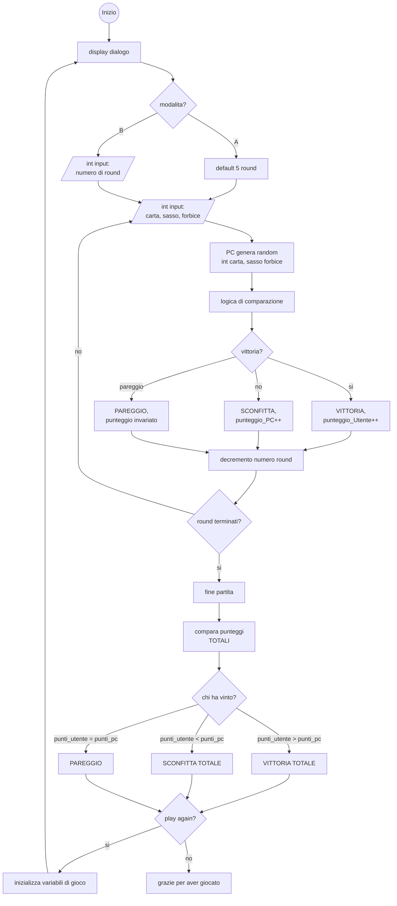

# Sasso, Carta, Forbice
Sviluppa un semplice gioco di "Sasso, Carta, Forbici" contro il computer. Genera casualmente la scelta del computer, quindi confrontala con quella del giocatore usando una serie di condizioni per determinare chi vince. Puoi aggiungere un contatore per tenere traccia dei punteggi.
## v1.0
### Passaggi:
- Generare n int random dove n1 = sasso, n2 = carta, n3 = forbice in `randomPC`
- Acquisire `manoUtente`
- Logica di comparazione
    - SASSO batte FORBICE
    - FORBICE batte CARTA
    - CARTA batte SASSO

### Traduzione della logica di comparazione in codice


```csharp
Console.Clear();
Random random = new Random();
int numUser;

string manoPC = "";
string manoUser = "";
int randomPC;

randomPC = random.Next(1,4); // da 1 a 3

Console.WriteLine("[1] SASSO\t[2] CARTA\t [3] FORBICE");
Console.WriteLine("Scelta:");
numUser = int.Parse(Console.ReadLine());

switch (numUser){
    case 1:
        manoUser = "SASSO";  
    break;
    case 2:
        manoUser = "CARTA"; 
    break;
    case 3:
        manoUser = "FORBICE";
    break;
}

switch (randomPC){
    case 1:
        manoPC = "SASSO";
    break;
    case 2:
        manoPC = "CARTA"; 
    break;
    case 3:
        manoPC = "FORBICE"; 
    break;
}

if (manoUser == "CARTA" && manoPC == "SASSO" || manoUser == "FORBICE" && manoPC == "CARTA" || manoUser == "SASSO" && manoPC == "FORBICE")
{
    Console.WriteLine($"TU\t\tAVVERSARIO");
    Console.WriteLine($"{manoUser}\t\t{manoPC}\n");
    Console.WriteLine("Hai vinto!");
} else {
    Console.WriteLine($"TU\t\tAVVERSARIO");
    Console.WriteLine($"{manoUser}\t\t{manoPC}\n");
    Console.WriteLine("Hai perso!");
}
```


> Comandi di versionamento:
``` powershell
git add --all
git commit -m "Sasso, Carta, Forbice (v1.0)"
git push -u origin main
```

#### Aggiornamento v1.09
- Codice più leggibile
- Console più pulita
- Commenti


```csharp
// Pulizia Console
Console.Clear();


// Dichiarazione
int numUser;
int randomPC;
string manoUser = "";
string manoPC = "";
Random random = new Random();


// Dialogo
Console.WriteLine("[1] SASSO\t[2] CARTA\t [3] FORBICE");
Console.Write("> ");
numUser = int.Parse(Console.ReadLine());


// Controllo inserimento
while (numUser != 1 && numUser != 2 && numUser != 3)
{

    Console.Clear();
    Console.WriteLine("Inserimento non valido.");
    Console.WriteLine("[1] SASSO\t[2] CARTA\t [3] FORBICE");
    Console.Write("> ");
    numUser = int.Parse(Console.ReadLine());

}


// Assegnazione mano utente 
switch (numUser)
{

    case 1:
        manoUser = "SASSO";  
    break;

    case 2:
        manoUser = "CARTA"; 
    break;

    case 3:
        manoUser = "FORBICE";
    break;

}


// Assegnazione mano PC
randomPC = random.Next(1,4); //
switch (randomPC)
{

    case 1:
        manoPC = "SASSO";
    break;

    case 2:
        manoPC = "CARTA"; 
    break;

    case 3:
        manoPC = "FORBICE"; 
    break;

}


// Dialogo
Console.Clear();
Console.WriteLine("'SASSO, CARTA, FORBICE!'");
Console.WriteLine("Premi un tasto per giocare...");
Console.ReadKey();


// Logica di comparazione
if (manoUser == "CARTA" && manoPC == "SASSO" || manoUser == "FORBICE" && manoPC == "CARTA" || manoUser == "SASSO" && manoPC == "FORBICE")
{

    // Vittoria
    Console.Clear();
    Console.WriteLine($"Tu\t\tAvversario");
    Console.WriteLine($"{manoUser}\t\t{manoPC}\n");
    Console.WriteLine("Hai vinto!\n");

} 
else 
{

    // Sconfitta
    Console.Clear();
    Console.WriteLine($"Tu\t\tAvversario");
    Console.WriteLine($"{manoUser}\t\t{manoPC}\n");
    Console.WriteLine("Hai perso!\n");

}
```


> Comandi di versionamento:
``` powershell
git add --all
git commit -m "Sasso, Carta, Forbice (v1.09)"
git push -u origin main
```

---
### Obiettivi per la v1.1
- Considerare la condizione di pareggio. Nessuno vince, nessuno perde.
- Inserire il gioco in un ciclo di 5 round `do{}while(contatoreRound != 0)`
    - Creare `int contatoreRound = 5`
    - `contatoreRound--` alla fine di ogni ciclo.


```csharp
// Pulizia Console
Console.Clear();


// Dichiarazione
int numUser;
int randomPC;
int contatoreRound = 5;
int dialogoRound = 1;
string manoUser = "";
string manoPC = "";
Random random = new Random();


// Dialogo iniziale
Console.WriteLine("*** SASSO, CARTA FORBICE! ***");
Console.WriteLine("\nPremi un tasto per giocare...");
Console.ReadKey();


do
{

    // Dialogo Round
    Console.Clear();
    Console.WriteLine($"Round {dialogoRound}\n");


    // Dialogo inserimento
    Console.WriteLine("[1] SASSO\t[2] CARTA\t [3] FORBICE");
    Console.Write("> ");
    numUser = int.Parse(Console.ReadLine());


    // Controllo inserimento
    while (numUser != 1 && numUser != 2 && numUser != 3)
    {

        Console.Clear();
        Console.WriteLine("Inserimento non valido.");
        Console.WriteLine("[1] SASSO\t[2] CARTA\t [3] FORBICE");
        Console.Write("> ");
        numUser = int.Parse(Console.ReadLine());
        
    }


    // Assegnazione mano utente 
    switch (numUser)
    {

        case 1:
            manoUser = "SASSO";  
        break;

        case 2:
            manoUser = "CARTA"; 
        break;

        case 3:
            manoUser = "FORBICE";
        break;

    }


    // Assegnazione mano PC
    randomPC = random.Next(1,4); //
    switch (randomPC)
    {

        case 1:
            manoPC = "SASSO";
        break;

        case 2:
            manoPC = "CARTA"; 
        break;

        case 3:
            manoPC = "FORBICE"; 
        break;

    }


    // Dialogo
    Console.Clear();
    Console.WriteLine("'SASSO, CARTA, FORBICE!'");
    Console.WriteLine("\nPremi un tasto per giocare...");
    Console.ReadKey();


    // Logica di comparazione
    if (manoUser == "CARTA" && manoPC == "SASSO" || manoUser == "FORBICE" && manoPC == "CARTA" || manoUser == "SASSO" && manoPC == "FORBICE")
    {

        // Vittoria
        Console.Clear();
        Console.WriteLine($"Tu\t\tAvversario");
        Console.WriteLine($"{manoUser}\t\t{manoPC}\n");
        Console.WriteLine("Hai vinto!\n");

    }
    else if (manoUser == manoPC)
    {

        // Pareggio
        Console.Clear();
        Console.WriteLine($"Tu\t\tAvversario");
        Console.WriteLine($"{manoUser}\t\t{manoPC}\n");
        Console.WriteLine("Pareggio!\n");

    } 
    else 
    {

        // Sconfitta
        Console.Clear();
        Console.WriteLine($"Tu\t\tAvversario");
        Console.WriteLine($"{manoUser}\t\t{manoPC}\n");
        Console.WriteLine("Hai perso!\n");

    }


    // Ometti dialogo "Continua" quando c'è l'ultimo Round
    if (contatoreRound-1 != 0)
    {

        // Dialogo
        Console.WriteLine("Continua...");
        Console.ReadKey();

    }


    // Decremento contatore
    contatoreRound--;

    // Incremento dialogoRound
    dialogoRound++;


} while (contatoreRound != 0);


Console.WriteLine("Fine partita!\n");
```


> Comandi di versionamento:
``` powershell
git add --all
git commit -m "Sasso, Carta, Forbice (v1.1)"
git push -u origin main
```
---
### Obiettivi per la v1.2
- Memorizzare e aggiornare punteggio in un array `int[] allPunteggio = allPunteggio [2]` alla fine di ogni ciclo.
    - In `allPunteggio [0]++;` incremento punteggio Avversario 
    - In `allPunteggio [1]++;` incremento punteggio Utente


```csharp
// Pulizia Console
Console.Clear();


// Dichiarazione
int numUser;
int randomPC;
int contatoreRound = 5;
int Utente = 1;
int Avversario = 0;
int[] allPunteggio = new int[2];
int dialogoRound = 1;
string manoUser = "";
string manoPC = "";
Random random = new Random();


// Inizializzazione punteggi
allPunteggio[0] = 0; // Avversario
allPunteggio[1] = 0; // Utente


// Dialogo iniziale
Console.WriteLine("*** SASSO, CARTA FORBICE! ***");
Console.WriteLine("Versione: 1.2");
Console.WriteLine("\nPremi un tasto per giocare...");
Console.ReadKey();


do
{

    // Dialogo Round
    Console.Clear();
    Console.WriteLine($"Round {dialogoRound}\n");


    // Dialogo inserimento
    Console.WriteLine("[1] SASSO\t[2] CARTA\t [3] FORBICE");
    Console.Write("> ");
    numUser = int.Parse(Console.ReadLine());


    // Controllo inserimento
    while (numUser != 1 && numUser != 2 && numUser != 3)
    {

        Console.Clear();
        Console.WriteLine("Inserimento non valido.");
        Console.WriteLine("[1] SASSO\t[2] CARTA\t [3] FORBICE");
        Console.Write("> ");
        numUser = int.Parse(Console.ReadLine());
        
    }


    // Assegnazione mano utente 
    switch (numUser)
    {

        case 1:
            manoUser = "SASSO";  
        break;

        case 2:
            manoUser = "CARTA"; 
        break;

        case 3:
            manoUser = "FORBICE";
        break;

    }


    // Assegnazione mano PC
    randomPC = random.Next(1,4); //
    switch (randomPC)
    {

        case 1:
            manoPC = "SASSO";
        break;

        case 2:
            manoPC = "CARTA"; 
        break;

        case 3:
            manoPC = "FORBICE"; 
        break;

    }


    // Dialogo
    Console.Clear();
    Console.WriteLine("'SASSO, CARTA, FORBICE!'");
    Console.WriteLine("\nPremi un tasto per giocare...");
    Console.ReadKey();


    // Logica di comparazione
    if (manoUser == "CARTA" && manoPC == "SASSO" || manoUser == "FORBICE" && manoPC == "CARTA" || manoUser == "SASSO" && manoPC == "FORBICE")
    {

        // Vittoria
        Console.Clear();
        Console.WriteLine($"Tu\t\tAvversario");
        Console.WriteLine($"{manoUser}\t\t{manoPC}\n");
        Console.WriteLine("Hai vinto!\n");

        // Aggiornamento punteggio
        allPunteggio[Utente]++;

    }
    else if (manoUser == manoPC)
    {

        // Pareggio
        Console.Clear();
        Console.WriteLine($"Tu\t\tAvversario");
        Console.WriteLine($"{manoUser}\t\t{manoPC}\n");
        Console.WriteLine("Pareggio!\n");

    } 
    else 
    {

        // Sconfitta
        Console.Clear();
        Console.WriteLine($"Tu\t\tAvversario");
        Console.WriteLine($"{manoUser}\t\t{manoPC}\n");
        Console.WriteLine("Hai perso!\n");
        
        // Aggiornamento punteggio
        allPunteggio[Avversario]++;

    }


    // Ometti dialogo "Continua" quando c'è l'ultimo Round
    if (contatoreRound-1 != 0)
    {

        // Dialogo
        Console.WriteLine("Continua...");
        Console.ReadKey();

    }


    // Decremento contatore
    contatoreRound--;

    // Incremento dialogoRound
    dialogoRound++;


} while (contatoreRound != 0);


// Dialogo risultati
Console.WriteLine("--------------------------");
Console.WriteLine("Fine partita!\n");
Console.WriteLine("Ecco i punteggi...");
Console.WriteLine($"\nTu\t\tAvversario");
Console.WriteLine($"{allPunteggio[Utente]}\t\t{allPunteggio[Avversario]}\n");


// Logica di comparazione dei risultati
if (allPunteggio[Utente] > allPunteggio[Avversario])
{

    // Hai battuto il tuo avversario!
    Console.WriteLine("CONGRATULAZIONI! HAI BATTUTO IL TUO AVVERSARIO!");

}
else if (allPunteggio[Utente] == allPunteggio[Avversario])
{

    // Avete pareggiato!
    Console.WriteLine("ABBIAMO UN PAREGGIO!");

}
else
{

    Console.WriteLine("MI DISPIACE, SEI STATO SCONFITTO!");

}


// Dialogo
Console.WriteLine("Grazie per aver giocato!\n");
```


> Comandi di versionamento:
``` powershell
git add --all
git commit -m "Sasso, Carta, Forbice (v1.2)"
git push -u origin main
```
---
### Obiettivi per la v1.3
- Mostrare punteggio affianco al giocatore e curare il layout.
```
Tu(3)       Avversario(2)
CARTA       SASSO

Hai vinto!
```


```csharp
// Pulizia Console
Console.Clear();


// Dichiarazione
int numUser;
int randomPC;
int contatoreRound = 5;
int Utente = 1;
int Avversario = 0;
int[] allPunteggio = new int[2];
int dialogoRound = 1;
string manoUser = "";
string manoPC = "";
Random random = new Random();


// Inizializzazione punteggi
allPunteggio[0] = 0; // Avversario
allPunteggio[1] = 0; // Utente


// Dialogo iniziale
Console.WriteLine("*** SASSO, CARTA FORBICE! ***");
Console.WriteLine("Versione: 1.3");
Console.WriteLine("\nPremi un tasto per giocare...");
Console.ReadKey();


do
{

    // Dialogo Round
    Console.Clear();
    Console.WriteLine($"Round {dialogoRound}\n");


    // Dialogo inserimento
    Console.WriteLine("[1] SASSO\t[2] CARTA\t [3] FORBICE");
    Console.Write("> ");
    numUser = int.Parse(Console.ReadLine());


    // Controllo inserimento
    while (numUser != 1 && numUser != 2 && numUser != 3)
    {

        Console.Clear();
        Console.WriteLine("Inserimento non valido.");
        Console.WriteLine("[1] SASSO\t[2] CARTA\t [3] FORBICE");
        Console.Write("> ");
        numUser = int.Parse(Console.ReadLine());
        
    }


    // Assegnazione mano utente 
    switch (numUser)
    {

        case 1:
            manoUser = "SASSO";  
        break;

        case 2:
            manoUser = "CARTA"; 
        break;

        case 3:
            manoUser = "FORBICE";
        break;

    }


    // Assegnazione mano PC
    randomPC = random.Next(1,4); //
    switch (randomPC)
    {

        case 1:
            manoPC = "SASSO";
        break;

        case 2:
            manoPC = "CARTA"; 
        break;

        case 3:
            manoPC = "FORBICE"; 
        break;

    }


    // Dialogo
    Console.Clear();
    Console.WriteLine("'SASSO, CARTA, FORBICE!'");
    Console.WriteLine("\nPremi un tasto per giocare...");
    Console.ReadKey();


    // Logica di comparazione
    if (manoUser == "CARTA" && manoPC == "SASSO" || manoUser == "FORBICE" && manoPC == "CARTA" || manoUser == "SASSO" && manoPC == "FORBICE")
    {

        // Aggiornamento punteggio
        allPunteggio[Utente]++;

        // Vittoria
        Console.Clear();
        Console.WriteLine($"Tu({allPunteggio[Utente]})\t\tAvversario({allPunteggio[Avversario]})");
        Console.WriteLine($"{manoUser}\t\t{manoPC}\n");
        Console.WriteLine("Hai vinto!\n");

    }
    else if (manoUser == manoPC)
    {

        // Pareggio
        Console.Clear();
        Console.WriteLine($"Tu({allPunteggio[Utente]})\t\tAvversario({allPunteggio[Avversario]})");
        Console.WriteLine($"{manoUser}\t\t{manoPC}\n");
        Console.WriteLine("Pareggio!\n");

    } 
    else 
    {

        // Aggiornamento punteggio
        allPunteggio[Avversario]++;

        // Sconfitta
        Console.Clear();
        Console.WriteLine($"Tu({allPunteggio[Utente]})\t\tAvversario({allPunteggio[Avversario]})");
        Console.WriteLine($"{manoUser}\t\t{manoPC}\n");
        Console.WriteLine("Hai perso!\n");

    }


    // Ometti dialogo "Continua" quando c'è l'ultimo Round
    if (contatoreRound-1 != 0)
    {

        // Dialogo
        Console.WriteLine("Continua...");
        Console.ReadKey();

    }


    // Decremento contatore
    contatoreRound--;

    // Incremento dialogoRound
    dialogoRound++;


} while (contatoreRound != 0);


// Dialogo risultati
Console.WriteLine("--------------------------");
Console.WriteLine("Fine partita!\n");
Console.WriteLine("Ecco i punteggi...");
Console.WriteLine($"\nTu\t\tAvversario");
Console.WriteLine($"{allPunteggio[Utente]}\t\t{allPunteggio[Avversario]}\n");


// Logica di comparazione dei risultati
if (allPunteggio[Utente] > allPunteggio[Avversario])
{

    // Hai battuto il tuo avversario!
    Console.WriteLine("CONGRATULAZIONI! HAI BATTUTO IL TUO AVVERSARIO!");

}
else if (allPunteggio[Utente] == allPunteggio[Avversario])
{

    // Avete pareggiato!
    Console.WriteLine("ABBIAMO UN PAREGGIO!");

}
else
{

    Console.WriteLine("MI DISPIACE, SEI STATO SCONFITTO!");

}


// Dialogo
Console.WriteLine("Grazie per aver giocato!\n");
```


> Comandi di versionamento:
``` powershell
git add --all
git commit -m "Sasso, Carta, Forbice (v1.3)"
git push -u origin main
```
---
### Obiettivi per la v1.4 (funzioni già implementate nella v1.2)
- Quando esce dal ciclo `do{}While();` Compara i risultati per decretare il vincitore.

> Codice implementato
```csharp
// Dialogo risultati
Console.WriteLine("--------------------------");
Console.WriteLine("Fine partita!\n");
Console.WriteLine("Ecco i punteggi...");
Console.WriteLine($"\nTu\t\tAvversario");
Console.WriteLine($"{allPunteggio[Utente]}\t\t{allPunteggio[Avversario]}\n");


// Logica di comparazione dei risultati
if (allPunteggio[Utente] > allPunteggio[Avversario])
{

    // Hai battuto il tuo avversario!
    Console.WriteLine("CONGRATULAZIONI! HAI BATTUTO IL TUO AVVERSARIO!");

}
else if (allPunteggio[Utente] == allPunteggio[Avversario])
{

    // Avete pareggiato!
    Console.WriteLine("ABBIAMO UN PAREGGIO!");

}
else
{

    Console.WriteLine("MI DISPIACE, SEI STATO SCONFITTO!");

}


// Dialogo
Console.WriteLine("Grazie per aver giocato!\n");
```


> Comandi di versionamento:
``` powershell
git add --all
git commit -m "Sasso, Carta, Forbice (v1.4)"
git push -u origin main
```

## v2.0
### Obiettivi
- inserimento di un menù iniziale
    - default: 5 round
    - custom: numero di round inseriti dall'utente
    - prosegui con Console pulita

- Gioca di nuovo / Esci
    - Con azzeramento e inizializzazioni di variabili


```csharp
// Pulizia Console
Console.Clear();


// Dichiarazione
int numUser;
int randomPC;
int contatoreRound = 5;
int Utente = 1;
int Avversario = 0;
int[] allPunteggio = new int[2];
int dialogoRound = 1;
bool convertito = false;
string sceltaMenu = "";
string manoUser = "";
string manoPC = "";
Random random = new Random();


// Dialogo iniziale
Console.WriteLine("*** SASSO, CARTA FORBICE! ***");
Console.WriteLine("Versione: 2.0");
Console.WriteLine("\nPremi un tasto per giocare...");
Console.ReadKey();


do{     // ! PLAY AGAIN inizia QUI

    // Inizializzazione NEW GAME / PLAY AGAIN
    allPunteggio[0] = 0; // Avversario
    allPunteggio[1] = 0; // Utente
    contatoreRound = 5;
    dialogoRound = 1;
    sceltaMenu = "";
    convertito = false;


    //Menu con controllo inserimento
    do
    {
        // Dialogo
        Console.Clear();
        Console.WriteLine("MENU:");
        Console.WriteLine("Scegliere la modalità di gioco");
        Console.WriteLine("[A] Default: 5 round");
        Console.WriteLine("[B] Custom");
        Console.Write("\n> ");

        // Acquisizione
        sceltaMenu=Console.ReadLine();
        sceltaMenu = sceltaMenu.ToUpper();

    } while (sceltaMenu != "A" && sceltaMenu != "B");


    // Acquisizione numero Round da utente con controllo conversione
    while (sceltaMenu == "B" && convertito == false)
    {

        //Dialogo
        Console.Clear();
        Console.WriteLine("Quanti Round vuoi giocare?");
        convertito = int.TryParse(Console.ReadLine(), out contatoreRound);

    }


    do      // ! ROUND inizia QUI
    {

        // Dialogo Round
        Console.Clear();
        Console.WriteLine($"Round {dialogoRound}\n");


        // Dialogo inserimento
        Console.WriteLine("[1] SASSO\t[2] CARTA\t [3] FORBICE");
        Console.Write("> ");
        numUser = int.Parse(Console.ReadLine());


        // Controllo inserimento
        while (numUser != 1 && numUser != 2 && numUser != 3)
        {

            Console.Clear();
            Console.WriteLine("Inserimento non valido.");
            Console.WriteLine("[1] SASSO\t[2] CARTA\t [3] FORBICE");
            Console.Write("> ");
            numUser = int.Parse(Console.ReadLine());
            
        }


        // Assegnazione mano utente 
        switch (numUser)
        {

            case 1:
                manoUser = "SASSO";  
            break;

            case 2:
                manoUser = "CARTA"; 
            break;

            case 3:
                manoUser = "FORBICE";
            break;

        }


        // Assegnazione mano PC
        randomPC = random.Next(1,4); //
        switch (randomPC)
        {

            case 1:
                manoPC = "SASSO";
            break;

            case 2:
                manoPC = "CARTA"; 
            break;

            case 3:
                manoPC = "FORBICE"; 
            break;

        }


        // Dialogo
        Console.Clear();
        Console.WriteLine("'SASSO, CARTA, FORBICE!'");
        Console.WriteLine("\nPremi un tasto per giocare...");
        Console.ReadKey();


        // Logica di comparazione
        if (manoUser == "CARTA" && manoPC == "SASSO" || manoUser == "FORBICE" && manoPC == "CARTA" || manoUser == "SASSO" && manoPC == "FORBICE")
        {

            // Aggiornamento punteggio vittoria Utente
            allPunteggio[Utente]++;

            // Vittoria
            Console.Clear();
            Console.WriteLine($"Tu({allPunteggio[Utente]})\t\tAvversario({allPunteggio[Avversario]})");
            Console.WriteLine($"{manoUser}\t\t{manoPC}\n");
            Console.WriteLine("Hai vinto!\n");

        }
        else if (manoUser == manoPC)
        {

            // Pareggio
            Console.Clear();
            Console.WriteLine($"Tu({allPunteggio[Utente]})\t\tAvversario({allPunteggio[Avversario]})");
            Console.WriteLine($"{manoUser}\t\t{manoPC}\n");
            Console.WriteLine("Pareggio!\n");

        } 
        else 
        {

            // Aggiornamento punteggio vittori Avversario
            allPunteggio[Avversario]++;

            // Sconfitta
            Console.Clear();
            Console.WriteLine($"Tu({allPunteggio[Utente]})\t\tAvversario({allPunteggio[Avversario]})");
            Console.WriteLine($"{manoUser}\t\t{manoPC}\n");
            Console.WriteLine("Hai perso!\n");

        }


        // Ometti dialogo "Continua" quando c'è l'ultimo Round
        if (contatoreRound-1 != 0)
        {

            // Dialogo
            Console.WriteLine("Continua...");
            Console.ReadKey();

        }


        // Decremento contatore
        contatoreRound--;

        // Incremento dialogoRound
        dialogoRound++;


    } while (contatoreRound != 0);  // ! ROUND finisce QUI

    // Dialogo risultati
    Console.WriteLine("--------------------------");
    Console.WriteLine("Fine partita!\n");
    Console.WriteLine("Ecco i punteggi...");
    Console.WriteLine($"\nTu\t\tAvversario");
    Console.WriteLine($"{allPunteggio[Utente]}\t\t{allPunteggio[Avversario]}\n");


    // Logica di comparazione dei risultati
    if (allPunteggio[Utente] > allPunteggio[Avversario])
    {

        // Hai battuto il tuo avversario!
        Console.WriteLine("CONGRATULAZIONI! HAI BATTUTO IL TUO AVVERSARIO!");

    }
    else if (allPunteggio[Utente] == allPunteggio[Avversario])
    {

        // Avete pareggiato!
        Console.WriteLine("ABBIAMO UN PAREGGIO!");

    }
    else
    {

        Console.WriteLine("MI DISPIACE, SEI STATO SCONFITTO!");

    }


    // Controllo PLAY AGAIN
    do
    {  

        Console.WriteLine("\n\nVuoi giocare di nuovo?");
        Console.WriteLine("[A] SI\t[B] NO");
        Console.Write("> ");
        sceltaMenu = Console.ReadLine();
        sceltaMenu = sceltaMenu.ToUpper();
        
        // Pulizia Console per DISPLAY AGAIN
        if (sceltaMenu != "A" && sceltaMenu != "B")
        {
            Console.Clear();
        }

    } while (sceltaMenu != "A" && sceltaMenu != "B");


} while (sceltaMenu == "A"); // ! PLAY AGAIN finisce QUI

// Dialogo
Console.WriteLine("Grazie per aver giocato!\n");
```


> Comandi di versionamento:
``` powershell
git add --all
git commit -m "Sasso, Carta, Forbice (v2)"
git push -u origin main
```

> Flowchart della versione 2



> Comandi di versionamento:
``` powershell
git add --all
git commit -m "Sasso, Carta, Forbice (v2) - Flowchart Mermaid"
git push -u origin main
```